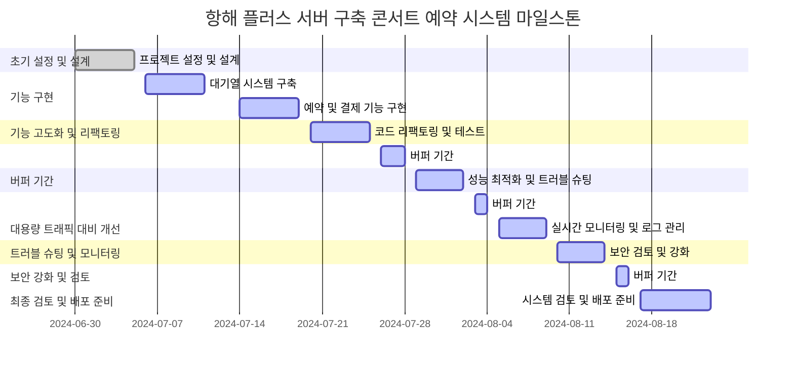

##### 항해 플러스 서버 구축 콘서트 예약 시스템

<details>
<summary><b>요구사항</b></summary>

<details>
<summary><b>Description</b></summary>

> 💡 아래 명세를 잘 읽어보고, 서버를 구현합니다.

- `콘서트 예약 서비스`를 구현해 봅니다.
- 대기열 시스템을 구축하고, 예약 서비스는 작업가능한 유저만 수행할 수 있도록 해야합니다.
- 사용자는 좌석예약 시에 미리 충전한 잔액을 이용합니다.
- 좌석 예약 요청시에, 결제가 이루어지지 않더라도 일정 시간동안 다른 유저가 해당 좌석에 접근할 수 없도록 합니다.

</details>

<details>
<summary><b>Requirements</b></summary>

- 아래 5가지 API 를 구현합니다.
    - 유저 토큰 발급 API
    - 예약 가능 날짜 / 좌석 API
    - 좌석 예약 요청 API
    - 잔액 충전 / 조회 API
    - 결제 API
- 각 기능 및 제약사항에 대해 단위 테스트를 반드시 하나 이상 작성하도록 합니다.
- 다수의 인스턴스로 어플리케이션이 동작하더라도 기능에 문제가 없도록 작성하도록 합니다.
- 동시성 이슈를 고려하여 구현합니다.
- 대기열 개념을 고려해 구현합니다.
</details>

<details>
<summary><b>API Specs</b></summary>


1️⃣ **`주요` 유저 대기열 토큰 기능**

- 서비스를 이용할 토큰을 발급받는 API를 작성합니다.
- 토큰은 유저의 UUID 와 해당 유저의 대기열을 관리할 수 있는 정보 ( 대기 순서 or 잔여 시간 등 ) 를 포함합니다.
- 이후 모든 API 는 위 토큰을 이용해 대기열 검증을 통과해야 이용 가능합니다.

> 기본적으로 폴링으로 본인의 대기열을 확인한다고 가정하며, 다른 방안 또한 고려해보고 구현해 볼 수 있습니다.
>

**2️⃣ `기본` 예약 가능 날짜 / 좌석 API**

- 예약가능한 날짜와 해당 날짜의 좌석을 조회하는 API 를 각각 작성합니다.
- 예약 가능한 날짜 목록을 조회할 수 있습니다.
- 날짜 정보를 입력받아 예약가능한 좌석정보를 조회할 수 있습니다.

> 좌석 정보는 1 ~ 50 까지의 좌석번호로 관리됩니다.
>

3️⃣ **`주요` 좌석 예약 요청 API**

- 날짜와 좌석 정보를 입력받아 좌석을 예약 처리하는 API 를 작성합니다.
- 좌석 예약과 동시에 해당 좌석은 그 유저에게 약 5분간 임시 배정됩니다. ( 시간은 정책에 따라 자율적으로 정의합니다. )
- 만약 배정 시간 내에 결제가 완료되지 않는다면 좌석에 대한 임시 배정은 해제되어야 하며 다른 사용자는 예약할 수 없어야 한다.

4️⃣ **`기본`**  **잔액 충전 / 조회 API**

- 결제에 사용될 금액을 API 를 통해 충전하는 API 를 작성합니다.
- 사용자 식별자 및 충전할 금액을 받아 잔액을 충전합니다.
- 사용자 식별자를 통해 해당 사용자의 잔액을 조회합니다.

5️⃣ **`주요` 결제 API**

- 결제 처리하고 결제 내역을 생성하는 API 를 작성합니다.
- 결제가 완료되면 해당 좌석의 소유권을 유저에게 배정하고 대기열 토큰을 만료시킵니다.


</details>

<details>
<summary><b>💡KEY POINT</b></summary>

- 유저간 대기열을 요청 순서대로 정확하게 제공할 방법을 고민해 봅니다.
- 동시에 여러 사용자가 예약 요청을 했을 때, 좌석이 중복으로 배정 가능하지 않도록 합니다.

</details>

</details>


<details>
<summary><b>유저 스토리</b></summary>

### 통합 시나리오

1. 클라이언트가 예약 가능한 날짜와 좌석 정보를 서버에 요청합니다.
2. 서버는 예약 가능한 날짜와 좌석 정보를 반환합니다.
3. 클라이언트가 사용자의 토큰을 요청하여 대기열에 진입합니다.
4. 서버는 대기열에서 사용자의 순서를 확인하고, 유효한 토큰을 발급합니다.
5. 클라이언트가 유효한 토큰을 이용해 좌석 예약을 서버에 요청합니다.
6. 서버는 좌석을 임시 예약하고, 예약 성공 여부를 반환합니다.
7. 예약 성공 시, 클라이언트가 결제를 서버에 요청합니다.
8. 서버는 결제 처리를 완료하고, 좌석 예약을 확정합니다.

### 세부 시나리오

#### 1. 예약 가능한 날짜 및 좌석 조회


1. 클라이언트가 서버에 `/available-dates` API를 호출하여 예약 가능한 날짜 목록을 요청합니다.
2. 서버는 예약 가능한 날짜 목록을 조회하여 클라이언트에 반환합니다.
3. 클라이언트가 특정 날짜를 선택하고, 서버에 `/available-seats` API를 호출하여 해당 날짜의 예약 가능한 좌석 정보를 요청합니다.
4. 서버는 해당 날짜의 예약 가능한 좌석 목록을 조회하여 클라이언트에 반환합니다.


#### 2. 유저 대기열 토큰 발급

1. 클라이언트가 서버에 `/token-request` API를 호출하여 대기열 토큰을 요청합니다.
2. 서버는 사용자의 UUID와 대기열 정보를 기반으로 토큰을 생성합니다.
3. 서버는 대기열에 사용자를 등록하고, 대기열 순서를 관리합니다.
4. 서버는 유효한 토큰을 클라이언트에 전달해야 합니다. 
5. 클라이언트는 대기열 상태를 확인하기 위해 서버에 주기적으로 대기열 상태를 요청(polling)하거나, 서버가 대기열 상태를 클라이언트에 전달(SSE)을 사용하거나 웹소켓을 이용해 통신할 수 있습니다. 
  - **Polling**:
    1. 클라이언트는 일정 주기로 서버에 `/queue-status` API를 호출하여 대기열 상태를 요청합니다.
    2. 서버는 현재 대기열 상태(현재 순서, 잔여 시간 등)를 조회하여 클라이언트에 반환합니다.
  - **SSE**:
    1. 클라이언트는 서버에 `/queue-status-sse` API를 호출하여 SSE 연결을 시작합니다.
    2. 서버는 대기열 상태가 변경될 때마다 클라이언트에 실시간으로 상태 정보를 전송합니다.
  - **WebSocket**:
    1. 클라이언트는 서버와 WebSocket 연결을 설정합니다.
    2. 서버는 대기열 상태가 변경될 때마다 클라이언트에 실시간으로 상태 정보를 전송합니다.


#### 3. 좌석 예약 요청


1. 클라이언트가 서버에 `/reserve-seat` API를 호출하여 좌석 예약 요청을 보냅니다.
2. 서버는 사용자의 토큰을 검증하여 유효성을 확인합니다.
3. 토큰이 유효한 경우, 서버는 해당 좌석을 사용자를 위해 임시 예약합니다.
4. 서버는 임시 예약 시간을 설정하고, 다른 사용자가 해당 좌석에 접근하지 못하도록 합니다.
5. 서버는 예약 성공 여부를 클라이언트에 반환합니다.

#### 4. 결제 처리


1. 클라이언트가 서버에 `/process-paymentEntity` API를 호출하여 결제 요청을 보냅니다.
2. 서버는 사용자의 토큰을 검증하여 유효성을 확인합니다.
3. 토큰이 유효한 경우, 서버는 좌석 예약 정보를 확인합니다.
4. 서버는 결제 처리를 진행합니다.
5. 결제가 성공하면 서버는 좌석 예약을 확정하고, 대기열 토큰을 만료시킵니다.
6. 서버는 결제 성공 메시지를 클라이언트에 반환합니다.
7. 결제가 실패할 경우, 서버는 임시 예약을 취소하고, 클라이언트에 실패 메시지를 반환합니다.

</details>


<details>
<summary><b>시퀀스 다이어그램</b></summary>


## part1: 대기열 생성 및 관리


## part2: 예약/결제


</details>


<details>
<summary><b>아키텍처 구상도</b></summary>

### 아키텍처 


</details>


<details>
<summary><b>Milestone</b></summary>

### 마일스톤

#### 1주차 (6월 30일 - 7월 5일)
- **프로젝트 시작 및 초기 설정**
  - 프로젝트 저장소와 초기 폴더 구조를 설정합니다.
  - 프로젝트 요구사항을 분석하고 시나리오 및 시퀀스 다이어그램을 작성합니다.
  - 데이터베이스 스키마와 ERD를 계획하고 설계합니다.
  - Mock API를 작성합니다.

#### 2주차 (7월 6일 - 7월 12일)
- **대기열 시스템 구축**
  - 유저 토큰 발급 API 구현
  - 대기열 관리 시스템 구현
  - WebSocket을 통한 대기열 상태 확인 기능 개발

#### 3주차 (7월 13일 - 7월 19일)
- **예약 및 결제 기능 구현**
  - 예약 가능한 날짜/좌석 조회 API 구현
  - 좌석 예약 요청 API 구현
  - 잔액 충전/조회 API 구현
  - 결제 API 구현

#### 4주차 (7월 20일 - 7월 26일)
- **기능 고도화 및 리팩토링**
  - 코드 리팩토링 및 최적화
  - 유닛 테스트 작성 및 통합 테스트 수행
  - 에러 핸들링 및 예외 처리 강화

#### 5주차 (7월 27일 - 8월 2일)
- **대용량 트래픽 대비 개선**
  - 동시성 이슈 해결 및 성능 최적화
  - 로드 테스트 및 성능 모니터링 도구 설정
  - 다중 인스턴스 환경에서의 동작 확인 및 개선

#### 6주차 (8월 3일 - 8월 9일)
- **트러블 슈팅 및 모니터링**
  - 실시간 모니터링 시스템 구축
  - 로그 관리 및 분석 시스템 설정
  - 장애 대응 시나리오 테스트 및 문서화

#### 7주차 (8월 10일 - 8월 16일)
- **보안 강화 및 검토**
  - API 보안 검토 및 취약점 점검
  - 데이터 보호 및 개인정보 처리 방침 검토
  - 보안 관련 유닛 테스트 및 통합 테스트 수행

#### 8주차 (8월 17일 - 8월 23일)
- **최종 검토 및 배포 준비**
  - 전체 시스템 검토 및 최종 리팩토링
  - 배포 스크립트 작성 및 배포 환경 설정
  - 최종 문서화 및 사용자 가이드 작성

### 요약

- **1주차:** 프로젝트 설정 및 초기 설계.
- **2~3주차:** 기능 구현 (대기열 시스템, 예약 및 결제 기능).
- **4~8주차:** 고도화 및 리팩토링, 대용량 트래픽 트러블 슈팅 대비 개선.





</details>


<details>
<summary><b>ERD</b></summary>

### erd


</details>


<details>
<summary><b>API Spec & Mock API</b></summary>


## Swagger 

### queue-management

> http://localhost:24031/queue-management/swagger-ui/index.html#/


### api-orchestration

> http://localhost:24051/api-orchestration/swagger-ui/index.html#/


### client-channel-service

> http://localhost:24101/client-channel/swagger-ui/index.html#/


### payment-service 

> http://localhost:24081/payment/swagger-ui/index.html#/


### reservation-service

> http://localhost:24071/reservation/swagger-ui/index.html#/


## 유저 토큰 발급 API

### Endpoint
```http request
POST http://localhost:24000/queue-management/api/token
Content-Type: application/json
```

### Request Body
```json
{
  "userId": "spring123",
  "requestedTime": "2024-07-03T10:00:00",
  "priority": 2
}
```

### Response
- **Status Code: 201 Created**
- **Headers:**
  - `Content-Type: application/json`
  - `Date: Thu, 04 Jul 2024 14:52:58 GMT`
- **Body:**
  ```json
  {
    "userId": "spring123",
    "tokenValue": "ce586fe5-78fb-4124-8e83-7cb164fbf58b",
    "remainingTime": "2024-07-05T00:22:58.008573",
    "position": 1,
    "validUntil": "2024-07-05T00:52:58.008641",
    "status": "WAITING"
  }
  ```


---

## 예약 가능한 날짜 목록 조회 API

### Endpoint
```http request
GET http://localhost:24000/api-orchestration/api/reservations/available-dates/1
```

### Response
- **Status Code: 200 OK**
- **Headers:**
  - `Content-Type: application/json`
  - `Date: Thu, 04 Jul 2024 14:55:57 GMT`
- **Body:**
  ```json
  {
    "concertId": 1,
    "availableDates": [
      "2024-07-10",
      "2024-07-11",
      "2024-07-12"
    ]
  }
  ```


---

## 특정 날짜의 예약 가능한 좌석 목록 조회 API

### Endpoint
```http request
GET http://localhost:24000/api-orchestration/api/reservations/available-seats?concertId=1&date=2024-07-10
```

### Response
- **Status Code: 200 OK**
- **Headers:**
  - `Content-Type: application/json`
  - `Date: Thu, 04 Jul 2024 14:56:00 GMT`
- **Body:**
  ```json
  {
    "concertId": 1,
    "date": "2024-07-10",
    "availableSeats": [
      {"seatId": 1, "seatNumber": "A1"},
      {"seatId": 2, "seatNumber": "A2"},
      ...
    ]
  }
  ```


---

## 좌석 예약 요청 API

### Endpoint
```http request
POST http://localhost:24000/api-orchestration/api/reservations/reserve-seat
Content-Type: application/json
```

### Request Body
```json
{
  "userId": 1,
  "concertOptionId": 1,
  "seatId": 1,
  "date": "2024-07-10"
}
```

### Response
- **Status Code: 200 OK**
- **Headers:**
  - `Content-Type: application/json`
  - `Date: Thu, 04 Jul 2024 14:45:42 GMT`
- **Body:**
  ```json
  {
    "reservationId": 1,
    "userId": 1,
    "concertOptionId": 1,
    "seatId": 1,
    "status": "TEMPORARY_RESERVED",
    "message": "2024-07-04T23:50:42.733509분간 예약되었습니다."
  }
  ```


---

## 잔액 충전 API

### Endpoint
```http request
POST http://localhost:24000/api-orchestration/api/balance/charge
Content-Type: application/json
```

### Request Body
```json
{
  "userId": 1,
  "amount": 100.00
}
```

### Response
- **Status Code: 200 OK**
- **Headers:**
  - `Content-Type: application/json`
  - `Date: Thu, 04 Jul 2024 14:45:45 GMT`
- **Body:**
  ```json
  {
    "userId": 1,
    "amount": 100.00
  }
  ```


---

## 잔액 조회 API

### Endpoint
```http request
POST http://localhost:24000/api-orchestration/api/balance/payment
Content-Type: application/json
```

### Request Body
```json
{
  "userId": 1,
  "reservationId": 1,
  "amount": 100.00
}
```

### Response
- **Status Code: 200 OK**
- **Headers:**
  - `Content-Type: application/json`
  - `Date: Thu, 04 Jul 2024 14:45:46 GMT`
- **Body:**
  ```json
  {
    "paymentId": 1,
    "userId": 1,
    "reservationId": 1,
    "amount": 100.00,
    "status": "CONFIRMED",
    "message": "결제가 정상 처리되었고, 좌석도 예약 완료"
  }
  ```


</details>


<details>
<summary><b>Tests</b></summary>

## 서비스별 테스트 코드 현황

- 총계: 91 건

### api-orchestration-service

- 14 건


### queue-management-service

- 38 건 


### reservation-service


- 14 건


### payment-service

- 22 건


### client-channel-service 

- 3 건


</details>


<details>
<summary><b>구상 단계에서의 기술적 고민들</b></summary>

# 구상 단계에서의 기술적 고민들

## 1. 대기열 상태 인지 방법

대기열 상태를 유저에게 전달하는 방법에 대해 고민했다. 

### Polling

- **방법**: Polling 방식은 클라이언트가 일정한 주기로 서버에 대기열 상태를 요청하고, 서버가 해당 정보를 응답하는 방식이다.
- **장점**: Polling은 구현이 간단하다. 
- **해결하는 문제**: 대기열 상태를 주기적으로 업데이트하여 클라이언트가 최신 정보를 얻을 수 있도록 한다. 주기성을 두어 부하를 조절할 수 있다.
- **예상되는 어려움**:
  - 동기적으로 작동하여 서버와 클라이언트 모두에서 성능 최적화가 어렵다. 
  - 실시간성이 떨어지며, 대기열 상태가 자주 변경될 경우 업데이트가 지연될 수 있다.

### Server-Sent Events (SSE)

- **방법**: SSE 방식은 서버가 클라이언트에 실시간으로 대기열 상태를 전송하는 단방향 통신 방식이다. 클라이언트는 초기 연결을 설정한 후 서버에서 보내는 이벤트를 수신한다.

- **장점**: SSE는 서버에서 클라이언트로 실시간 이벤트를 전송할 수 있습니다. 실시간성이 반영된다.

- **해결하는 문제**:
  - 서버에서 클라이언트로의 실시간 데이터 전송을 통해 대기열 상태 변경을 즉시 반영할 수 있다.
  - 클라이언트의 반복적인 요청을 줄여 서버 부하를 감소시킨다.

- **예상되는 어려움**:
  - 많은 클라이언트가 연결될 경우 서버 부하가 증가할 수 있다. 
  - 모든 이벤트에 대해 처리하다 보면, 대규모 트래픽 환경에서 서버 부하가 심해질 수 있다. 특히 이벤트 방식의 비동기 처리를 고려한다면 서버에서 동시에 처리해야 하는 이벤트의 양이 증가하면 큰 부하가 예상된다.

### WebSocket

- **방법**: WebSocket 방식은 서버와 클라이언트 간의 양방향 실시간 통신을 가능하게 한다. 초기 연결 이후 지속적인 연결을 유지하며 데이터 전송 시 오버헤드가 적다.

- **장점**: WebSocket은 양방향 통신을 지원하여 대기열 상태 변경을 실시간으로 주고받을 수 있다.

- **해결하는 문제**:
  - 실시간 데이터 전송을 통해 대기열 상태를 즉시 업데이트하고, 양방향 통신으로 클라이언트와 서버 간 원활한 통신이 가능한다.
  - 효율적인 데이터 전송으로 대규모 트래픽을 처리할 수 있다.

- **예상되는 어려움**:
  - 구현이 복잡하고 방화벽이나 프록시 설정 문제를 겪을 수 있다.
  - 많은 클라이언트가 연결될 경우 서버 자원 소모에 대해 고민해야 한다.
  - 모든 이벤트에 대해 처리하다 보면, 대규모 트래픽 환경에서 서버 부하가 심해질 수 있다. 특히 이벤트 방식의 비동기 처리를 고려한다면 서버에서 동시에 처리해야 하는 이벤트의 양이 증가하면 큰 부하가 예상된다.


### 결론

대규모 서비스에서 웹소켓과 폴링을 선택할 때는, 실시간성과 연결 수용성 및 확장성을 중점으로 생각해보자.  

1. **실시간성이 중요한 경우**:
  - 웹소켓이 더 적합하다. 웹소켓은 실시간 양방향 통신을 제공하여 대기열 상태와 같은 실시간 업데이트를 효과적으로 처리할 수 있다.

2. **대규모 연결 및 확장성**:
  - 폴링이 더 적합할 수 있다. 폴링은 구현이 간단하고, 부하 조절이 용이하여 대규모 트래픽을 관리하기 쉽다. 폴링 주기를 최적화하고 상태 변경 감지를 통해 효율성을 개선할 수 있다.


## 2. 대기열 상태 업데이트 최적화

대기열 상태의 모든 변화를 실시간으로 전부 트래킹하는 것은 서버에 큰 부하를 줄 수 있다고 판단했다. 이에 대한 해결책으로 다음과 같은 방안을 고려했다.

### polling 최적화 

  1. **폴링 간격 최적화**: 클라이언트가 대기열 상태를 확인하는 폴링 주기를 최적화한다. 예를 들어, 초기 대기열에 진입한 사용자는 5초마다 폴링을 하고, 대기열 상위권에 근접한 사용자는 1초마다 폴링을 하도록 조정합니다. 이렇게 하면 서버의 부하를 최소화하면서도 사용자에게 중요한 시점에 실시간성을 제공할 수 있다.

  2. **상태 변경 감지**: 폴링 방식에서는 대기열 상태가 변경될 때만 클라이언트에게 응답하도록 서버를 설정한다. 상태가 변경되지 않았을 경우에는 응답을 보내지 않거나 최소한의 데이터만 전송하여 트래픽과 서버 부하를 줄일 수 있다.

### 이벤트 처리 최적화 

polling 대비 sse나 websocket을 사용하는 방식은 비동기적 프로세스를 이용할 수 있다는 장점이 있다. 그러나 모든 변화를 전부 감지하여 처리하면 서버 내부적으로 과도한 처리량이 발생할 수 있습니다. 이를 해결하기 위해 다음과 같은 방안을 고려했다.

1. **변경 구간 전송**: 대기열 상태의 모든 변화를 실시간으로 전송하는 대신, 대기열의 주요 변화만 전송한다. 예를 들어, 대기열 순서가 10명씩 변할 때마다 클라이언트에게 업데이트를 전송한다. 

2. **우선순위 기반 업데이트**: 대기열 상위에 있는 사용자가 더 자주 업데이트를 받도록 우선순위를 설정한다. 예를 들어, 대기열 상위 10명에게는 상태 변화를 실시간으로 전송하고, 나머지 사용자에게는 일정 간격(e.g. 1분)으로 요약된 상태를 전송한다. 

3. **이벤트 배치 처리**: 상태 변화를 개별적으로 처리하지 않고, 일정 시간 간격으로 배치 처리한다. 예를 들어, 1초 동안 발생한 모든 상태 변화를 모아서 한 번에 전송한다. 


## 3. 대기열 정보를 전달할 때 얼마나 정확해야 할까? 

대기 순서를 대기자들에게 알려주어야 한다는 요구 사항에 대해, 이 순서가 반드시 절대적으로 정확해야 할지에 대해서 고민할 필요가 있다. 대기 순서를 대략적으로 알려주어도 사용자에게 충분한 정보를 제공할 수 있다. 

### 대기열 데이터의 성격 및 특징

대기열 데이터의 성격과 특징을 생각해보자. 

- **변동성이 큰 데이터**: 대기열은 사용자 요청이 계속 들어오고 처리되는 과정에서 실시간으로 변동한다.
- **상대적인 정보**: 대기열은 특성상 상대적인 정보가 중요하다. 즉, 내 앞에 몇 명이 있는지가 절대적인 수치보다 중요하다.
- **예상 대기 시간**: 대기열은 그 자체의 정보보다 그로부터 얼마나 기다리는 시간이 중요하다. 


### 사용자 입장에서의 실질적인 니즈

대기열의 위와 같은 특성을 고려할 때, 실질적인 사용자의 니즈를 생각해보자. 

- **투명성**: 사용자는 자신의 요청이 처리되고 있다는 확신을 원한다. 따라서 본인의 위치 정보에 대한 정보는 어떤식으로든 제공되어야 한다. 
- **예측 가능성**: 사용자들은 자신이 얼마나 기다려야 하는지 알고 싶어 한다. 사용자 입장에서 대기열의 "몇 번째"라는 절대적인 사실 자체보다는 대기 시간이 어느 정도일지에 대한 정보가 더 중요할 수 있다. 
- **실제 알고 싶은 것**: 사용자 입장에서는 자신의 대기 순서가 정확히 몇 번째인지 알기보다는, 대략적인 위치나 예상 대기 시간을 알고 싶어 할 수 있다. 


### 대기 순서를 대략적으로 알려주는 방법

위와 같은 대기열의 특성과 사용자 니즈를 바탕으로, 대기 순서를 대략적으로 알려주는 몇 가지 방법을 고려해보자. 

1. **대기열 그룹화**:
  - 대기열을 여러 개의 그룹으로 나누어 사용자에게 그룹 내에서의 순서를 알려준다. 예를 들어, "당신은 현재 50-100번 그룹에 있습니다"와 같은 방식으로 정보를 제공한다. 이는 대기열의 변동성을 줄이면서도 사용자가 자신의 위치를 대략적으로 알 수 있도록 한다.

2. **ETA(Estimated Time of Arrival) 제공**:
  - 대기열 순서 대신 예상 대기 시간을 알려준다. 예를 들어, "현재 대기 시간은 약 5분입니다"와 같은 방식으로 정보를 제공하여 사용자가 얼마나 기다려야 하는지 알 수 있게 한다. 

3. **확률적 대기열 정보 제공**:
  - 대기열의 상태를 확률적으로 제공하여 사용자가 어느 정도 대기해야 할지를 대략적으로 예측할 수 있게 한다. 예를 들어, "당신은 현재 상위 20%의 대기열에 있습니다"와 같은 정보를 제공한다. 


  
### 결론

대기열은 매우 동적이다. 사용자 요청의 속도와 처리 시간에 따라 실시간으로 변동된다. 유저 수가 많을수록 대기열의 순서가 빠르게 변화할 수 있다. 이런 환경에서 절대적으로 정확한 순서보다 대략적인 순서나 예상 대기 시간을 제공하는 것이 실효성 차원에서 나은 선택일 수 있다.


## 4. 콘서트 옵션 - 좌석 생성 방식에 대한 쟁점 


Concert Option와 Seat의 연관관계 기반의 프로세스에서 좌석을 언제 생성할 것인가 문제가 있다. 
즉, 콘서트 옵션 생성 시점에서 할 것인지, 실제 예약 요청 시점에서 할 것인지에 대한 문제이다. 
각각의 접근 방식에는 장단점이 있어서 다음과 같이 고민해보았다. 


### 엔티티 구조와 관계

먼저 엔티티 간의 관계를 살펴보자.

1. **Concert**: 콘서트 자체를 의미한다. 
2. **Concert Option**: 콘서트의 특정 옵션 또는 인스턴스를 나타내며, 날짜, 시간, 티켓 가격 등을 설정한다.
3. **Seat**: 특정 콘서트 옵션 내에서 예약 가능한 개별 좌석을 나타낸다.

Concert는 여러 Concert Option을 가지고, 각 Concert Option은 여러 Seat를 가진다. 


<details>
<summary><b>Concert</b></summary>


```java
@Entity
@Builder
@AllArgsConstructor
@NoArgsConstructor
@Getter
@EntityListeners({AuditingEntityListener.class})
public class Concert {
    @Id
    @GeneratedValue(strategy = GenerationType.IDENTITY)
    private Long concertId;
    private String title;
    @CreatedDate
    @Column(updatable = false)
    @Setter
    private LocalDateTime createdAt;
    @Setter
    private LocalDateTime requestAt;
}
```
</details>


<details>
<summary><b>ConcertOption</b></summary>

```
@Entity
@Builder
@AllArgsConstructor
@NoArgsConstructor
@Getter
@EntityListeners({AuditingEntityListener.class})
public class ConcertOption {
    @Id
    @GeneratedValue(strategy = GenerationType.IDENTITY)
    private Long concertOptionId;
    @ManyToOne
    @JoinColumn(name = "concert_id")
    private Concert concert;
    private LocalDateTime concertDate;
    private Duration concertDuration;
    private String title;
    private String description;
    private BigDecimal price;
    @CreatedDate
    @Column(updatable = false)
    @Setter
    private LocalDateTime createdAt;
    @Setter
    private LocalDateTime requestAt;
}
```
</details>


<details>
<summary><b>Seat</b></summary>
```
@Entity
@Builder
@AllArgsConstructor
@NoArgsConstructor
@Getter
@EntityListeners({AuditingEntityListener.class})
public class Seat {
    @Id
    @GeneratedValue(strategy = GenerationType.IDENTITY)
    private Long seatId;
    @ManyToOne
    @JoinColumn(name = "concert_option_id")
    private ConcertOption concertOption;
    private Long seatNumber;
    private Boolean occupied;
    @CreatedDate
    @Column(updatable = false)
    @Setter
    private LocalDateTime createdAt;
}
```

</details>


### 1. 콘서트 옵션 생성 시 좌석 생성 전략

#### 장점:
- **즉시 사용 가능**: 콘서트 옵션이 생성되자마자 좌석이 준비해 놓는 방식이다. 조회시 이미 생성된 좌석을 불러오기만 하면 된다.

#### 단점:
- **잠재적 오버헤드**: 콘서트 옵션 생성 로직과 결합도가 크다. 대규모 이벤트의 경우, 수천, 수만 개의 좌석을 미리 생성한다면, 옵션 생성 자체에서 시간 소요가 클 수 있다.
- **미사용 좌석**: 콘서트 옵션이 매진되지 않으면 미리 생성된 좌석이 가비지가 될 수 있다. 

### 2. 예약 요청 시 좌석 생성 전략

#### 장점:
- **자원 효율성**: 수요가 있을 때만 좌석을 생성하여 불필요한 자원을 절약할 수 있다.

#### 단점:
- **증가된 예약 지연**: 실시간으로 좌석을 생성하므로 예약 과정에서 지연을 초래할 수 있다.
- **복잡한 예약 로직**: 좌석 생성과 동시에 좌석 이용 가능성을 처리하는 부분에서 복잡도가 올라간다.


### 기술적 고려 사항

### 성능
- **사전 생성**: 예측 가능한 높은 수요와 많은 좌석이 있는 이벤트에 적합하다. 
- **요청 시 생성**: 수요가 불확실한 동적 환경에 이상적이다. 초기 오버헤드를 줄일 수 있지만, 동시성 처리가 필요하다.

### 데이터 일관성
- **사전 생성**: 좌석이 미리 정의되어 있고 상태만 변경되므로 데이터 일관성이 보장된다.
- **요청 시 생성**: 충돌을 피하고 좌석 가용성을 보장하기 위해 신중한 관리가 필요하다.

### 동시성
- **사전 생성**: 좌석 엔티티가 미리 존재하므로 동시성 관리가 간단하다.
- **요청 시 생성**: 동시에 들어오는 요청을 처리하고 중복 좌석 생성을 방지하기 위해 강력한 동시성 제어가 필요하다.

### 멘토링 피드백

허재 코치님의 공개 Q&A 세션에서 다음과 같은 피드백을 받았다.

1. **부하 관리**: 예약 요청 시 좌석을 생성하는 것은 피크 타임에 상당한 부하를 줄 수 있다. 
2. **동시성 문제**: 요청 시 좌석 생성을 처리하기 위한 동시성 처리가 필요하다. 
3. **가비지 데이터?**: 미리 생성해 놓는 것을 꼭 가비지로 볼 것인가? 통계 자료 활용 등에서도 보다 유연하고 쉽게 대응할 수 있지 않나?

### 결론

초기 생각했던 것은, 예약 API가 호출되는 시점은 이미 유량 제어가 된 시점이므로, 예약과 좌석을 결합하는 방식이 나쁘지 않을 것이라고 생각했다. 

하지만 그렇더라도 동시성 이슈나 복잡도 측면에서 난이도가 더 어려운 접근이라고 판단했다. 

미리 생성해두는 방식을 선택하기에 가장 마음에 걸렸던 부분은 `미리 생성해둔 좌석이 예마가 안되면?` `예를 들어 10만 건 예매 했는데 3만 건만 예약되면 7만 건은 가비지 아닌가?` 였다. 

그런데 그 자원이 서버에 그렇게 부담이 되는가를 고려했을 때, 그렇게 큰 부담은 아닐 수 있고, 또 가비지 데이터에 대해서는 사후 처리로 관리하기도 용이할 것이라 판단했다.

따라서 후자의 방식, 즉 예약 요청 시 좌석을 생성하는 방식을 선택하기로 결정했다.


## 5. 임시 예약과 예약에 대한 테이블 분리에 대한 쟁점 

임시 예약(temporary reservation)과 본 예약(confirmed reservation)을 어떻게 관리할 것인가에 대한 고민이 있다.

### 배경

사용자가 콘서트 예약을 요청하면, 서버는 먼저 임시 예약을 생성한다.
결제가 일정 시간 내에 완료되지 않으면, 이 임시 예약은 취소된다. 결제가 완료되면 임시 예약이 본 예약으로 확정된다. 
이때 임시 예약 관리에 대해, 두 가지 방식을 고려할 수 있다.
1. 예약 상태 필드를 통해 하나의 테이블에서 관리
2. 임시 예약과 본 예약을 별도의 테이블로 분리하여 관리

### 두 방식 비교

##### 상태 필드를 통한 관리
상태 필드를 통해 하나의 테이블에서 임시 예약과 본 예약을 관리하는 방법을 살펴보자.

장점은 구현이 간단하다는 것이다. 데이터베이스 스키마가 단순해지고, 단일 테이블에서 모든 예약 데이터를 조회할 수 있기 때문에 데이터 접근도 용이하다.

하지만 다음과 같은 단점들이 있다.

1. **모수 증가의 문제**: 테이블에 모든 예약 데이터를 저장할 경우, 데이터 모수 증가의 문제가 있다. 
2. **상태 관리 복잡성**: 상태 전이(transition)에 대한 일관성을 유지하도록 구현해야 한다. 

##### 테이블 분리를 통한 관리

별도 임시 예약 테이블로 분리하여 관리하는 방법은 관리 포인트를 명확히 분리하는 것이다. 

1. **데이터 관리 용이성**: 적은 모수의 장점이 있다. 관리와 성능에서 용이할 수 있다.

하지만, 이 방법 역시 다음과 같은 단점이 존재한다.

1. **구현의 복잡성**: 두 개의 테이블을 관리하기 위한 추가적인 로직이 필요하다. 
2. **동기화의 어려움**: 분리된 테이블 간의 데이터 일관성을 유지하기 위한 동기화 작업이 중요하다.

### 최종 결정: 테이블 분리
고민 끝에 임시 예약과 본 예약을 별도의 테이블로 분리하여 관리하는 방향으로 결정했다. 
주요 이유는 관리 포인트를 나누는 것이 좀 더 편하다고 생각했고, 또 확장성을 고려할 때 적은 모수라는 장점이 크다고 생각했다. 


## 6. MSA 아키텍처에서 '잔액'을 별도의 도메인 서비스로 분리하는 것에 대한 문제 


잔액 충전/조회 API를 개발하는 데 있어, 별도의 도메인 서비스로 'balance service'를 분리하는 것에 대해 검토해보았다.

### 도메인 모델링 관점에서의 적절성 검토

**도메인 모델링 견해 요약:**
- **Active Domain**: 사용자, 주문, 결제처럼 시스템에서 중요한 비즈니스 로직을 처리하며 독립적으로 행동하고 자신의 상태를 변경하거나 다른 객체와 상호작용하는 도메인
- **Passive Domain**: 콘서트 좌석이나 포인트처럼 주체적 도메인에 의해 상태가 변경되거나 영향을 받는 객체로, 독립적으로 비즈니스 기능을 제공하지 않는다.

**잔액(포인트) 도메인 분석:**
- 잔액(포인트)는 사용자의 행위(충전, 사용)에 의해 변경.
- 독립적으로 비즈니스 로직을 제공하기보다는 다른 도메인(예: 결제, 예약 등)의 행위에 의해 상태가 변경.

### 적절성 검토

**1. 독립적인 비즈니스 로직 제공 여부**
   - 잔액(포인트)는 자체적으로 독립적인 비즈니스 로직을 제공하지 않는다.
   - 충전 및 사용과 같은 행위는 사용자의 요청에 의해 발생하며, 자체적인 상태 변경은 없다.

**2. 시스템 내에서의 상호작용**
   - 잔액은 주로 결제 시스템과 상호작용하며, 결제 프로세스의 일부로 동작한다.
   - 잔액을 독립적인 서비스로 분리하면, 결제와의 상호작용에서 복잡성이 증가할 수 있다. 특히 트랜잭션 관리나 데이터 일관성 유지를 위한 추가적인 노력이 필요하다.

**3. 관리 및 유지보수**
   - 별도의 'balance service'로 분리하면, 단일 책임 원칙(Single Responsibility Principle)과 마이크로서비스 아키텍처의 장점을 살릴 수 있다.
   - 그러나, 시스템 복잡성이 증가하고, 여러 서비스 간의 통신 비용 및 오버헤드가 발생할 수 있다.

### 결론

잔액(포인트) 관리 기능이 시스템 내에서 중요한 비즈니스 로직을 독립적으로 제공하지 않기 때문에, 엄밀히 말하면 Passive Domain으로 볼 수 있다. 
따라서 별도의 도메인 서비스로 'balance service'를 분리하는 것은 필요에 따라 결정할 수 있다.

- **단순한 시스템**: 시스템 복잡성을 낮추고, 성능 이슈를 줄이기 위해 잔액 관리를 결제 서비스 내에 포함시키는 것이 더 효율적일 수 있다.
- **복잡한 시스템**: 시스템의 규모가 커지고, 잔액 관련 비즈니스 로직이 복잡해진다면 별도의 서비스로 분리하여 관리하는 것이 바람직할 수 있다.

현재 요구 사항과 시스템의 복잡성을 고려하여, 잔액 관리를 결제 서비스와 통합하여 구현하는 것이 적절하다고 판단. 
이후 시스템이 확장되고, 잔액 관련 로직이 복잡해진다면 그때 별도의 서비스로 분리하는 것을 고려하자.


</details>


<details>
<summary><b>WIL(What I Learend)</b></summary>


## jwt를 사용할 수 없는 이유(Opaque 토큰)

JWT (JSON Web Token)은 사용자 인증 및 정보 교환에 자주 사용되는 방식입니다. 현재 시나리오에서 JWT를 사용하는 것이 적합하지 않은 몇 가지 이유가 있습니다.

### 1. 동적 정보 업데이트의 어려움
JWT는 토큰 생성 시점에 정보를 인코딩하여 발행됩니다. 토큰이 발행된 후에는 토큰에 포함된 정보를 변경할 수 없습니다. 현재 시나리오에서는 사용자의 대기열 순서, 잔여 시간 등과 같은 동적 정보가 자주 변경됩니다. 이러한 정보를 실시간으로 업데이트하고 관리하는데 JWT를 사용하면 너무 많은 오버헤드가 예상됩니다.

### 2. 보안 및 유효성 검사
JWT는 클라이언트가 서버로부터 발급받아 이후 요청 시 포함하여 사용하는 방식입니다. 만약 대기열 토큰이 JWT로 구현된다면, 클라이언트가 토큰을 발급받은 이후에도 토큰의 유효성을 지속적으로 검증하고 대기열 상태를 업데이트하는 것이 어렵습니다. 대기열 시스템에서는 각 요청마다 토큰의 유효성을 확인하고, 대기열 상태를 갱신하며, 동시성 이슈를 관리해야 합니다. JWT는 이러한 요구사항을 충족하기 어렵습니다.

### 3. 토큰 만료 및 갱신
JWT는 만료 시간을 설정할 수 있지만, 만료된 토큰을 갱신하는 과정이 복잡할 수 있습니다. 대기열 시스템에서는 토큰의 유효성을 지속적으로 관리해야 하며, 토큰 만료 시 새로운 토큰을 발급받아야 합니다. 이러한 과정에서 발생할 수 있는 복잡성과 보안 문제를 고려할 때, JWT보다는 상태 저장 방식이 더 적합합니다.


### JWT에 대비되는 Opaque 토큰

Opaque 토큰은 JWT와 대비되는 다음과 같은 특징으로 인해 현재 시나리오에서 더 적합합니다.

1. **불투명성**:
- Opaque 토큰은 클라이언트가 그 내용을 해석할 수 없는 무작위 문자열로 구성됩니다. 토큰 자체에 정보를 포함하지 않으므로, 클라이언트가 토큰의 내용을 알 수 없습니다.

2. **상태 저장 방식 및 실시간성**:
- Opaque 토큰은 서버 측에서 상태 정보를 저장하고 관리합니다. 서버는 토큰과 연관된 모든 정보를 데이터베이스나 메모리에 저장하며, 클라이언트의 요청 시 이 정보를 조회하여 유효성을 검사합니다. 이는 동적 정보의 실시간 업데이트를 가능하게 합니다.
- Opaque 토큰은 서버 측에서 중앙 집중적으로 관리되므로, 토큰의 유효 기간과 상태를 동적으로 조정할 수 있습니다. 이는 대기열 시스템에서 각 사용자의 상태를 실시간으로 관리하고, 필요한 경우 토큰을 갱신하거나 무효화하는 데 적합합니다.

3. **유효성 검사**:
- 각 요청마다 서버에서 토큰의 유효성을 검사합니다. 서버는 내부 상태를 기반으로 토큰의 유효성을 확인하고, 필요할 경우 토큰을 무효화하거나 갱신할 수 있습니다. 이는 대기열 상태와 같은 동적 정보를 효과적으로 관리하는 데 유리합니다.

Opaque 토큰은 클라이언트가 토큰의 내용을 해석할 수 없게 하여 보안을 강화하고, 서버 측에서 상태 정보를 중앙에서 관리할 수 있도록 하는 방식입니다.
이러한 특성으로 사용자 대기열 관리와 같은 시나리오에서 특히 유용하며, JWT보다 적합한 선택이 될 수 있습니다.


</details>


<details>


<summary><b>설계 및 구상</b></summary>


<details>
<summary><b>개략적 규모 측정</b></summary>


## 시스템 규모 가정

- **총 유저 수**: 1,000,000명
- **수용 가능한 관객 수**: 100,000명
- **대기열 진입 유저 수**: 110,000명 (수용 가능한 관객 수의 110%)

## 유량 제어 메커니즘

- **처리 방식**: 은행 창구식 처리 방식을 채택하여 항상 활성 상태 인원수를 유지한다. (c.f. vs. 놀이공원 방식)
- **처리열 동시 접속 최대 인원수**: 6,000명
- **인원별 활성 상태 최대 시간**: 5분
- **인원별 활성 상태 시간 연장 가능 여부**: 향후 검토

## 트래픽 분석

1. **대기열 생성 및 관리**
  - 예상 트래픽: 전체 유저가 티켓팅에 동시에 접속한다고 가정.
  - 접속 희망 최대 유저 수: 1,000,000명
  - 대기열 진입 최대 유저 수: 110,000명
2. **대기열 인입 및 처리**
  - **인입율**: 초기 접속 유저의 인입 처리율은 분당 10,000명
  - **처리율**: 대기열에서 처리열로 분당 최대 6,000명의 유저 이동 가능.
  - **처리 과정**: 대기열에서 한 명이 처리열로 이동하면, 바로 다음 유저가 대기열에 추가된다.
3. **유량 제어**
  - **대기열 유량 제어**: 대기열에서는 최대 수용 인원 수를 100,000명으로 제한함으로써 대기열 서버의 부하를 관리한다.
  - **처리열 유량 제어**: 처리열에서는 분당 최대 6,000명의 요청을 처리함으로써 서버의 부하를 관리한다.
  - **구체적인 처리 메커니즘**: 유저의 상태를 추적하고 관리하는 방식은 다음과 같다.
    1. **상태 코드 부여**: 각 유저에게 고유의 토큰을 부여하여 대기열과 처리열에서 상태를 추적한다. 다음과 같은 상태 코드를 사용할 수 있다.
      - `대기`: 대기열에서 기다리고 있는 상태
      - `처리 중`: 처리열로 이동하여 활성 상태인 유저
      - `완료`: 예약을 성공적으로 마친 상태
      - `재진입`: 5분의 시간이 만료되어 대기열로 다시 돌아간 상태
    2. **상태 전이 관리**: 시스템은 일정 시간 간격으로 유저의 상태를 점검한다. 이때 상태 코드 혹은 TTL를 이용하여 전이를 관리한다. (시간 기반 트리거링 + 이벤트 기반 트리거링)
  - **시간 제약**: 처리열로 이동한 유저는 최대 시간(예: 5분) 동안 예약을 시도할 수 있다.
  - **처리 후 대기열 재진입**: 예약이 완료되지 않은 유저는 5분 후에 처리열에서 제거되며, 대기열로 재진입하여 다시 대기열 처리 과정을 반복한다.

## TPS 및 QPS 산정

1. **대기열 부분**
- **대기열 진입 TPS**: 전체 유저가 1분 동안 접속을 시도할 경우, 분당 10,000명씩 대기열에 진입한다고 가정.
- 대기열 진입 최대 TPS: 10,000명 ÷ 60초 = 약 167 TPS
- **대기열 상태 조회 TPS**: 최대 110,000명의 유저가 대기열 상태를 확인하기 위해 주기적으로 요청을 보낸다고 가정.
- 대기열 상태 조회 주기: 10초 간격
- 대기열 상태 조회 API Call MAX: 110,000명 ÷ 10초 = 11,000 API Call/초
- 대기열 상태 조회 QPS: 11,000 QPS
1. **처리열 부분**
  - **처리열 진입 TPS**: 처리열 MAX 수용치는 6,000명임에 따라 진입 요청의 최대 값은 6,000/분.
    - 처리열 진입 TPS: 6,000명 ÷ 60초 = 100 TPS
  - **처리열 상태 조회 TPS**: 처리열에 있는 유저들이 예약 상태를 주기적으로 확인한다고 가정.
    - 처리열 상태 조회 주기: 10초 간격
    - 처리열 상태 조회 API Call MAX: 6,000명 ÷ 10초 = 600 API Call
    - 처리열 상태 조회 QPS: 600 QPS
2. **예약 및 결제 (본 API) 부분**
  - 각 단계별 유저의 분포를 고려하여 계산.
  - **예약 가능 좌석 조회 TPS/QPS**: 처리열 유저들의 50%가 조회 요청한다고 가정.
    - 예약 가능 좌석 조회 QPS: 6,000명 × 50% ÷ 60초 = 50 QPS
  - **예약 상태 조회 TPS/QPS**: 처리열 유저들의 30%가 예약 상태 조회 요청한다고 가정.
    - 예약 상태 조회 QPS: 6,000명 × 30% ÷ 60초 = 30 QPS
  - **결제 처리 TPS/QPS**: 처리열 유저들의 20%가 결제 요청한다고 가정.
    - 결제 처리 TPS: 6,000명 × 20% ÷ 60초 = 20 TPS

## 이탈율 고려

실제 예약 단계에서 이탈되는 유저가 5%라고 가정하면, 6,000명의 유저가 처리열로 이동할 때 실제로 예약을 완료하는 유저는 95%인 5,700명.

## 100,000 좌석 마감에 걸리는 시간

- 매 분마다 6,000명이 처리열로 이동하고 이 중 5,700명이 실제로 예약을 완료한다고 가정.
- 따라서, 매 분 5,700명이 예약을 완료.
- 100,000 좌석을 예약하려면 100,000 ÷ 5,700 ≈ 17.54분이 필요.

## 물리 스펙 검토

### 어플리케이션 서버 성능 및 스펙 가정

어플리케이션 서버의 경우, 높은 CPU 성능을 가진 저비용 인스턴스를 여러 개 사용하는 것이 효과적일 수 있다. 또한, 고성능 비동기 처리를 위해 웹플럭스(WebFlux)나 Netty와 같은 기술을 고려할 수 있다.

- **어플리케이션 서버 스펙**: AWS t3.medium 인스턴스(vCPU 4개, 메모리 2GB)
- **스프링 부트**: 3.3.1
- **Tomcat**: 9.0
- **TPS**: 인스턴스 당 약 100 TPS (일반적인 웹 애플리케이션 기준)
- **QPS**: 인스턴스 당 약 1,000 QPS (일반적인 웹 애플리케이션 기준)

### DB 서버 성능 및 스펙 가정

- **DB 서버 스펙**: AWS RDS db.m5.large (vCPU 2개, 메모리 8GB)
- **MySQL 버전**: 8.0
- **DB TPS**: 인스턴스 당 약 1,000 TPS (읽기/쓰기 혼합 워크로드 기준)
- **DB QPS**: 인스턴스 당 약 10,000 QPS (읽기 기준)

## 물리 스펙 검토

### 어플리케이션 서버 TPS 및 QPS 감당 가능성 검토

1. **대기열 부분**
  - 대기열 진입 TPS: 167 TPS
    -> 2 x t3.medium 인스턴스 (100 TPS/인스턴스)
  - 대기열 상태 조회 QPS: 11,000 QPS
    -> 11 x t3.medium 인스턴스 (1,000 QPS/인스턴스)
2. **처리열 부분**
  - 처리열 진입 TPS: 100 TPS
    -> 1 x t3.medium 인스턴스
  - 처리열 상태 조회 QPS: 600 QPS
    -> 1 x t3.medium 인스턴스
3. **예약 및 결제 처리**
  - 예약 가능 좌석 조회 QPS: 50 QPS
    -> 1 x t3.medium 인스턴스
  - 예약 상태 조회 QPS: 30 QPS
    -> 1 x t3.medium 인스턴스
  - 결제 처리 TPS: 20 TPS
    -> 1 x t3.medium 인스턴스

### DB 서버 TPS 및 QPS 감당 가능성 검토

1. **대기열 상태 조회**
  - 읽기: 11,000 QPS
    -> 2 x db.m5.large 인스턴스 (10,000 QPS/인스턴스)
  - 쓰기: 167 TPS
    -> 1 x db.m5.large 인스턴스
2. **처리열 상태 조회**
  - 읽기: 600 QPS
    -> 1 x db.m5.large 인스턴스
  - 쓰기: 100 TPS
    -> 1 x db.m5.large 인스턴스
3. **예약 및 결제 처리**
  - 읽기: 80 QPS
    -> 1 x db.m5.large 인스턴스
  - 쓰기: 20 TPS
    -> 1 x db.m5.large 인스턴스

### 트래픽 처리를 위한 총 필요 인스턴스

- **어플리케이션 서버**:

  2 (대기열 진입) + 11 (대기열 상태 조회) + 1 (처리열 진입) + 1 (처리열 상태 조회) + 1 (예약 가능 좌석 조회) + 1 (예약 상태 조회) + 1 (결제 처리) = **18 인스턴스**

- **DB 서버**:

  2 (대기열 상태 조회 읽기) + 1 (대기열 상태 조회 쓰기) + 1 (처리열 상태 조회 읽기) + 1 (처리열 상태 조회 쓰기) + 1 (예약 및 결제 처리 읽기) + 1 (예약 및 결제 처리 쓰기) = **7 인스턴스**


## 비용 산정

### 어플리케이션 서버 비용

- **필요한 인스턴스 수**: 18개
- **시간당 비용**: $0.0416 (AWS t3.medium 인스턴스 기준)
- **월간 비용 계산**:
  - 시간당 비용: 18 인스턴스 x $0.0416/인스턴스 = $0.7488
  - 일일 비용: $0.7488 x 24시간 = $17.9712
  - 월간 비용: $17.9712 x 30일 = $539.136

### DB 서버 비용

- **필요한 인스턴스 수**: 7개
- **시간당 비용**: $0.096 (AWS RDS db.m5.large 인스턴스 기준)
- **월간 비용 계산**:
  - 시간당 비용: 7 인스턴스 x $0.096/인스턴스 = $0.672
  - 일일 비용: $0.672 x 24시간 = $16.128
  - 월간 비용: $16.128 x 30일 = $483.84

### 총 비용

- **어플리케이션 서버 비용**: $539.136/월
- **DB 서버 비용**: $483.84/월
- **총 월간 비용**: $539.136 + $483.84 = $1,022.976/월

## 유의미한 도출

병목 예상 구간 -> 대기열 관리, 특히 대기열 조회 부분!

</details>


<details>
<summary><b>예외 처리 및 알림 프로세스</b></summary>

비동기 예외와 전체 애플리케이션 예외를 포착하고, 로깅 및 알림을 별도로 관리하는 방식이 필요하여 구현한 예외 처리 및 알림 프로세스이다.

## 예외 처리 시스템

### 1. Global Exception Handler

`@RestControllerAdvice`와 `ResponseEntityExceptionHandler`를 활용한 전역 예외 처리를 구현 예시는 다음과 같다. 

모든 예외를 포착하고 적절한 로깅 및 응답을 제공한다.


<details>
<summary><b>구현 예시</b></summary>

```java
@RestControllerAdvice
@Slf4j
class ApiControllerAdvice extends ResponseEntityExceptionHandler {
    @ExceptionHandler(value = Exception.class)
    public Object handleException(Exception ex) {
        log.error("processUnDefinedErrors: {}", ex.getMessage());
        return new CommonApiResponse<>(UNKNOWN_ERROR);
    }

    @ExceptionHandler(ServerException.class)
    public Object processServerException(ServerException serverException) {
        log.error("ServerException: {}", serverException.getMessage());
        return new CommonApiResponse<>(serverException.getCode());
    }

    @ExceptionHandler(ItemNotFoundException.class)
    public Object processNotFoundException(ServerException serverException) {
        log.error("ServerException: {}", serverException.getMessage());
        return new CommonApiResponse<>(NO_CONTENT);
    }
}
```
</details>

### 2. Async Exception Handler

비동기 메서드에서 발생하는 예외를 처리하기 위한 `AsyncUncaughtExceptionHandler`의 구현 예시는 다음과 같다.

비동기 메서드에서 발생하는 예외는 일반적인 예외 처리 흐름에 포함되지 않으므로, 이를 별도로 처리해야 한다.


<details>
<summary><b>구현 예시</b></summary>

```java
@Component
@RequiredArgsConstructor
@Slf4j
public class CustomAsyncUncaughtExceptionHandler implements AsyncUncaughtExceptionHandler {

    private final GlobalExceptionAlertInternalPublisher globalExceptionAlertInternalPublisher;

    @Override
    public void handleUncaughtException(Throwable throwable, Method method, Object... obj) {
        log.error("Thread {} threw exception: {}", Thread.currentThread().getName(), throwable.getMessage());
        globalExceptionAlertInternalPublisher.publish(new GlobalExceptionAlertEvent("uncaughtException", throwable));
    }
}
```
</details>


### 3. AOP를 통한 예외 포착

애플리케이션 전역의 비동기 및 동기 메서드에서 발생하는 예외를 포착하기 위해 AOP를 활용했다.

<details>
<summary><b>구현 예시</b></summary>

```java
@Slf4j
@Aspect
@Component
@RequiredArgsConstructor
public class GlobalExceptionAlertAspect {

    private final GlobalExceptionAlertInternalPublisher globalExceptionAlertInternalPublisher;
    private final Set<Throwable> markedExceptions = Collections.newSetFromMap(new WeakHashMap<>());

    @Pointcut("execution(public * io.reservationservice.api..*(..))")
    void apiMethods() {}

    @Pointcut("@annotation(org.springframework.scheduling.annotation.Async)")
    void async() {}

    @Pointcut("!async()")
    void notAsync() {}

    @AfterThrowing(pointcut = "apiMethods() && notAsync()", throwing = "throwable")
    public void alertApplicationWideMethods(JoinPoint jp, Throwable throwable) {
        if (!isMarkedException(throwable)) {
            log.debug("(alertApplicationWideMethods) Class = {}, Method = {}, Cause = {}", jp.getSignature().getDeclaringTypeName(), jp.getSignature().getName(), throwable.getLocalizedMessage());
            globalExceptionAlertInternalPublisher.publish(new GlobalExceptionAlertEvent(jp.getSignature().getName(), throwable));
            markException(throwable);
        }
    }

    private boolean isMarkedException(Throwable throwable) {
        return markedExceptions.contains(throwable);
    }

    private void markException(Throwable throwable) {
        markedExceptions.add(throwable);
    }
}
```
</details>

이 클래스는 특정 포인트컷을 정의하고, 예외가 발생했을 때 이를 포착하여 알림을 발행한다. 
여기서 정의된 포인트컷은 `apiMethods`와 `async`이며, 비동기 메서드를 제외한 모든 메서드에서 발생한 예외를 포착한다. 
포착된 예외는 `GlobalExceptionAlertInternalPublisher`를 통해 알림으로 발행된다.

## 알림 시스템


`message-service`는 알림을 관리하는 별도의 마이크로서비스이다.
현재는 슬랙을 통해 알림을 지원하며, 추후 다른 알림 채널을 추가할 수 있다.

슬랙 메시지 예약 기능을 구현하여, 메시지를 예약하고 별도의 스레드에서 이를 폴링하여 발송한다.

### 설계 철학
알림 시스템은 메시지 서비스에서 독립적으로 동작하며, 사용자 요청에 대한 빠른 응답을 보장한다. 
알림을 즉시 발송하는 대신, 먼저 저장해 두고 내부에서 폴링(polling)을 통해 순차적으로 발송하는 방식을 채택했다. 
이러한 설계로 성능을 최적화하며, 메시지 발송 실패에 따른 재시도 등의 확장 로직 가능성을 열어둔다. 

### 1. 슬랙 메시지 서비스

`message service`의 슬랙 메시지 예약 및 발송을 처리하는 서비스이다.

<details>
<summary><b>구현 예시</b></summary>

```java
@Service
@RequiredArgsConstructor
public class SlackMessageService {

    private final SlackChannelRegistrar slackChannelRegistrar;
    private final SlackChannelRetriever slackChannelRetriever;
    private final SlackMessageSender slackMessageSender;
    private final SlackMessageReservationManager slackMessageReservationManager;

    public SlackChannelRegistrationResponse register(SlackChannelRegistrationRequest request) {
        return SlackChannelRegistrationResponse.from(slackChannelRegistrar.save(request.toCommand()));
    }

    public SlackMessageReserveResponse reserve(SlackMessageReserveRequest slackMessageReserveRequest) {
        SlackChannelInfo slackChannelInfo = slackChannelRetriever.retrieveSlackChannelByName(slackMessageReserveRequest.getChannelName());
        return SlackMessageReserveResponse.from(slackMessageReservationManager.reserve(slackMessageReserveRequest.toCommand().withChannelInfo(slackChannelInfo)));
    }

    public void sendReservedMessages() {
        SlackMessageReserveInfo slackMessageReserveInfo = slackMessageReservationManager.popNextReservedMessage();
        if (slackMessageReserveInfo.isEmpty()) {
            return;
        }
        slackMessageSender.sendAsync(slackMessageReserveInfo.toCommand());
        slackMessageReservationManager.markAsSentAsync(slackMessageReserveInfo.id());
    }
}
```

</details>


### 2. 슬랙 메시지 발송기

슬랙 메시지를 비동기적으로 발송하는 컴포넌트이다.

<details>
<summary><b>구현 예시</b></summary>

```java
@Component
@RequiredArgsConstructor
public class SlackMessageSender {

    private final Slack slack = Slack.getInstance();

    @SneakyThrows
    @Async("slackMessageSenderExecutor")
    public void sendAsync(SlackMessageSendCommand command) {
        ChatPostMessageRequest request = ChatPostMessageRequest.builder()
            .token(command.getToken())
            .channel(command.getChannelId())
            .text(command.getMessage())
            .build();

        slack.methods().chatPostMessage(request);
    }
}
```

</details>

### 3. 폴링 프로세서

예약된 메시지를 주기적으로 폴링하여 발송하는 프로세서이다.

<details>
<summary><b>구현 예시</b></summary>

```java
@Component
@RequiredArgsConstructor
public class SlackMessagePollingProcessor {

    private final SlackMessageService slackMessageService;

    @Value("${slack.message.polling.interval:100}")  // 폴링 간격 (기본값: 100ms)
    private long pollingInterval;

    public void startPolling() {
        while (true) {
            try {
                slackMessageService.sendReservedMessages();
                Thread.sleep(pollingInterval);
            } catch (InterruptedException e) {
                Thread.currentThread().interrupt();
                break;
            }
        }
    }
}
```
</details>


<details>
<summary><b>메시지 예시</b></summary>


</details>


</details>


</details>

