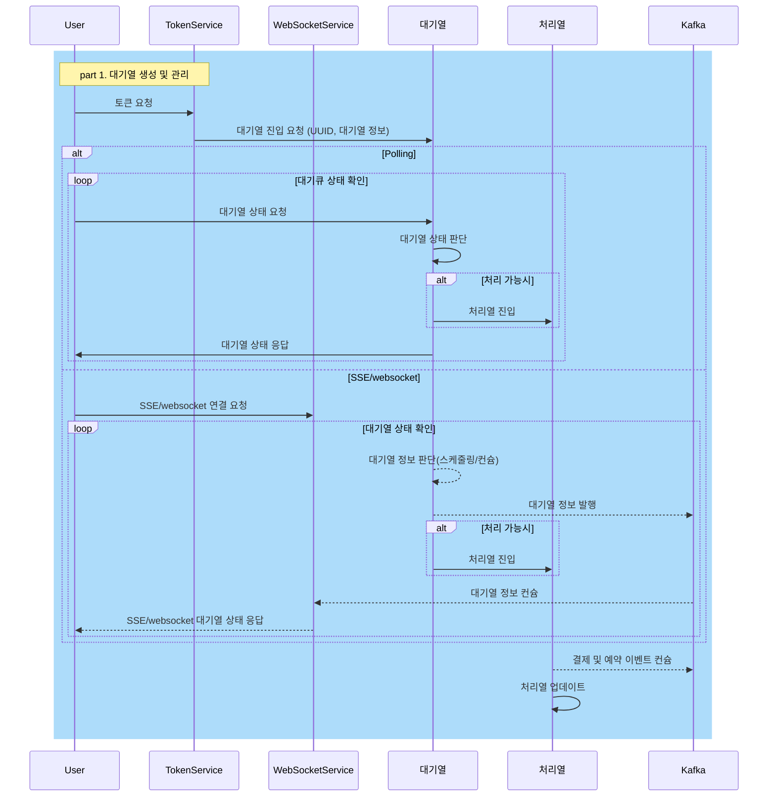
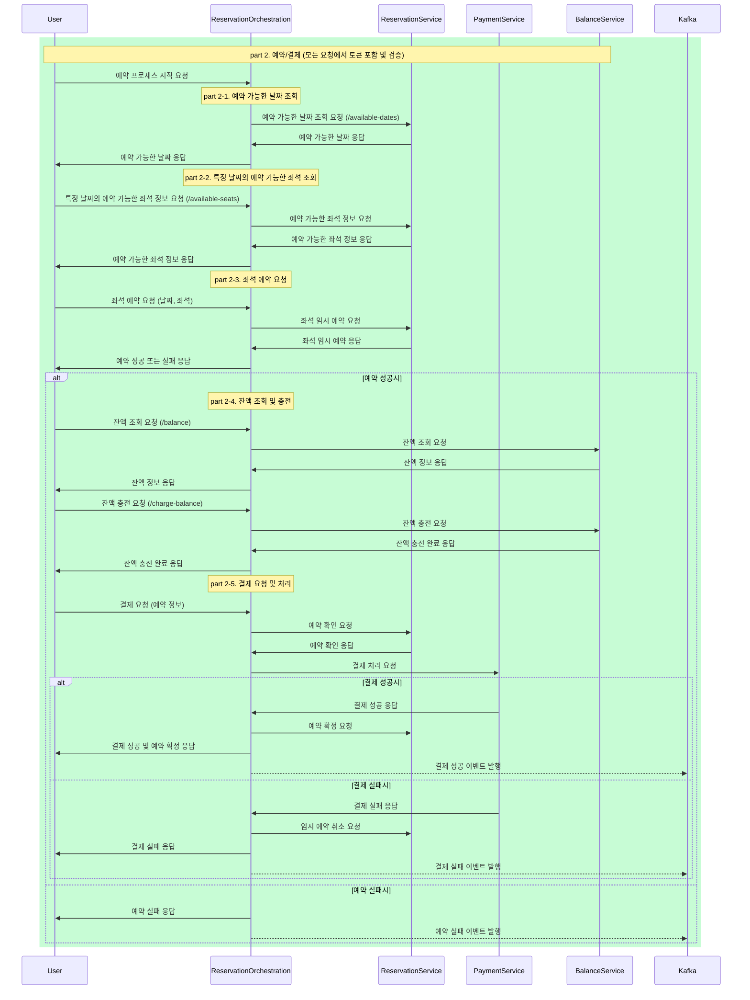

## part 1

```mermaid
sequenceDiagram
  participant User
  participant TokenService
  participant WebSocketService
  participant WaitingQueueService as 대기열
  participant ProcessingService as 처리열
  participant Kafka
  
  rect rgb(173, 220, 250)
    Note over User,TokenService: part 1. 대기열 생성 및 관리
    User->>TokenService: 토큰 요청
    TokenService->>WaitingQueueService: 대기열 진입 요청 (UUID, 대기열 정보)

    alt Polling
      loop 대기큐 상태 확인
        User->>WaitingQueueService: 대기열 상태 요청
        WaitingQueueService->>WaitingQueueService: 대기열 상태 판단
        alt 처리 가능시
          WaitingQueueService->>ProcessingService: 처리열 진입
        end
        WaitingQueueService->>User: 대기열 상태 응답
      end
    else SSE/websocket
      User->>WebSocketService: SSE/websocket 연결 요청
      loop 대기열 상태 확인
        WaitingQueueService-->>WaitingQueueService: 대기열 정보 판단(스케줄링/컨슘)
        WaitingQueueService-->>Kafka: 대기열 정보 발행
        alt 처리 가능시
          WaitingQueueService->>ProcessingService: 처리열 진입
        end
        Kafka-->>WebSocketService: 대기열 정보 컨슘
        WebSocketService-->>User: SSE/websocket 대기열 상태 응답
      end
    end
    ProcessingService-->>Kafka: 결제 및 예약 이벤트 컨슘
    ProcessingService->>ProcessingService: 처리열 업데이트
  end
```

## part 2

```mermaid
sequenceDiagram
  participant User
  participant OrchestrationService as ReservationOrchestration
  participant ReservationService
  participant PaymentService
  participant BalanceService
  participant Kafka
  
  rect rgb(199, 252, 213)
    Note over User,BalanceService: part 2. 예약/결제 (모든 요청에서 토큰 포함 및 검증)
    User->>OrchestrationService: 예약 프로세스 시작 요청 

    Note over OrchestrationService: part 2-1. 예약 가능한 날짜 조회
    OrchestrationService->>ReservationService: 예약 가능한 날짜 조회 요청 (/available-dates)
    ReservationService->>OrchestrationService: 예약 가능한 날짜 응답
    OrchestrationService->>User: 예약 가능한 날짜 응답

    Note over OrchestrationService: part 2-2. 특정 날짜의 예약 가능한 좌석 조회
    User->>OrchestrationService: 특정 날짜의 예약 가능한 좌석 정보 요청 (/available-seats)
    OrchestrationService->>ReservationService: 예약 가능한 좌석 정보 요청
    ReservationService->>OrchestrationService: 예약 가능한 좌석 정보 응답
    OrchestrationService->>User: 예약 가능한 좌석 정보 응답

    Note over OrchestrationService: part 2-3. 좌석 예약 요청
    User->>OrchestrationService: 좌석 예약 요청 (날짜, 좌석)
    OrchestrationService->>ReservationService: 좌석 임시 예약 요청
    ReservationService->>OrchestrationService: 좌석 임시 예약 응답
    OrchestrationService->>User: 예약 성공 또는 실패 응답

    alt 예약 성공시
      Note over OrchestrationService: part 2-4. 잔액 조회 및 충전
      User->>OrchestrationService: 잔액 조회 요청 (/balance)
      OrchestrationService->>BalanceService: 잔액 조회 요청
      BalanceService->>OrchestrationService: 잔액 정보 응답
      OrchestrationService->>User: 잔액 정보 응답

      User->>OrchestrationService: 잔액 충전 요청 (/charge-balance)
      OrchestrationService->>BalanceService: 잔액 충전 요청
      BalanceService->>OrchestrationService: 잔액 충전 완료 응답
      OrchestrationService->>User: 잔액 충전 완료 응답

      Note over OrchestrationService: part 2-5. 결제 요청 및 처리
      User->>OrchestrationService: 결제 요청 (예약 정보)
      OrchestrationService->>ReservationService: 예약 확인 요청
      ReservationService->>OrchestrationService: 예약 확인 응답
      OrchestrationService->>PaymentService: 결제 처리 요청

      alt 결제 성공시
        PaymentService->>OrchestrationService: 결제 성공 응답
        OrchestrationService->>ReservationService: 예약 확정 요청
        OrchestrationService->>User: 결제 성공 및 예약 확정 응답
        OrchestrationService-->>Kafka: 결제 성공 이벤트 발행
        
      else 결제 실패시
        PaymentService->>OrchestrationService: 결제 실패 응답
        OrchestrationService->>ReservationService: 임시 예약 취소 요청
        OrchestrationService->>User: 결제 실패 응답
        OrchestrationService-->>Kafka: 결제 실패 이벤트 발행
      end
    else 예약 실패시
      OrchestrationService->>User: 예약 실패 응답
      OrchestrationService-->>Kafka: 예약 실패 이벤트 발행
    end
  end
```