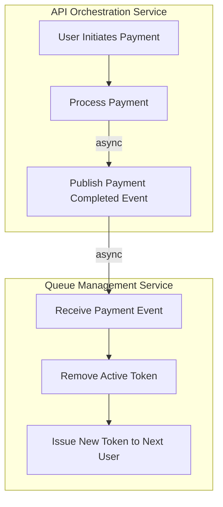
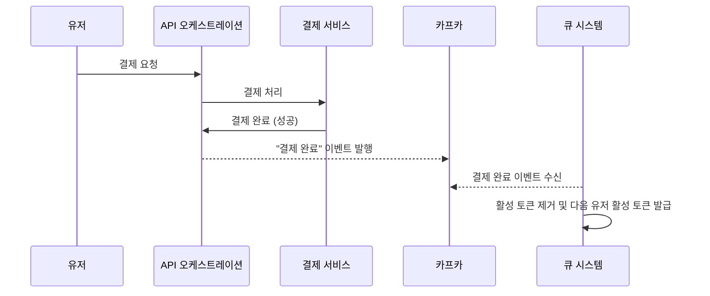
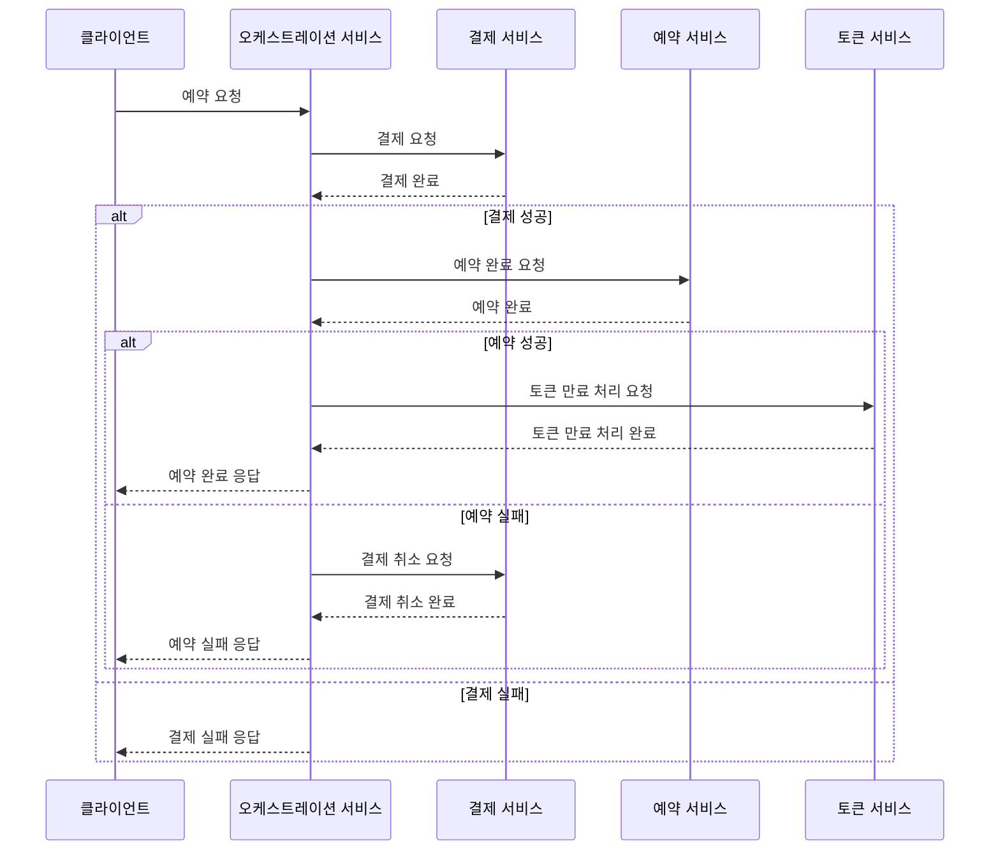

# MSA 아키텍처에서 느슨한 결합 추구하기  

이 글에서는 MSA 기반의 아키텍처에서 느슨한 결합을 추구하는 방법을 살펴본다. 
그 방법론 중 하나인 이벤트 드리븐 아키텍처(EDA)를 중심으로 현 프로젝트에서 어떻게 적용하였는지를 주로 다룬다. 
또한 트랜잭션이 분리된 서비스 간의 논리적인 일관성을 보장하기 위한 방법론도 함께 다룬다.

먼저 EDA가 무엇인지 설명하고, 현재의 대기열 기반 예약 시스템에 EDA를 적용하여 느슨한 결합을 구현하는 방법을 살펴보자. 

## 이벤트 드리븐 아키텍처(EDA)란?

이벤트 드리븐 아키텍처(Event-Driven Architecture)는 시스템에서 발생하는 이벤트를 기반으로 동작하는 소프트웨어 설계 패턴이다. 
그렇다면 이벤트란 무엇일까? 이벤트는 특정 동작이나 상태 변화를 나타낸다. 이벤트를 쉽게 이해하는 방법은 반대되는 개념을 살펴보는 것이다.
EDA와 반대되는 동기 통신에서는 한 구성 요소가 다른 구성 요소에 요청을 보내고 응답을 기다린다. 이 방식은 강한 결합이다. 한 모듈의 변경이 다른 모듈에 영향을 미치고, 응답을 기다리는 동안 다른 작업을 수행하지 못한다. 장애가 전파될 가능성도 있다. 동기 통신의 예로는 REST API 호출과 RPC가 있다. 

EDA는 이벤트를 발행하고 소비하는 방식으로 작동하며, 비동기 통신을 통해 이러한 문제를 해결한다. 
예를 들어, 사용자가 예약을 완료하면 예약 완료 이벤트가 발행되고, 이를 구독한 모듈들이 후속 작업을 수행한다.

## 느슨한 결합이란 게 왜 필요할까?


느슨한 결합(Loose Coupling)은 시스템의 구성 요소 간 의존성을 최소화하여 독립적으로 변경하고 확장할 수 있도록 하는 설계 원칙이다. 
예를 들어, 예약 시스템에서 대기열과 예약 API가 밀접하게 결합되어 있다면, 한 부분의 변경이 다른 부분에 큰 영향을 미칠 수 있다.

앞서 EDA와 반대되는 동기 통신을 살펴보았다. 
동기 통신에서는 한 구성 요소가 다른 구성 요소에 직접 의존하여 변경 시 상호 영향이 크다. 왜 그럴까? 동기 통신에서는 한 구성 요소가 요청을 보내고 다른 구성 요소가 응답을 반환할 때까지 기다리기 때문이다. 이 과정에서 요청과 응답이 밀접하게 연관되어 있어, 한 쪽의 변경이 다른 쪽의 동작에 즉각적인 영향을 미치게 된다. 예를 들어, API 계약이 변경되면 이를 호출하는 모든 클라이언트도 함께 변경되어야 한다. 이는 시스템의 유연성을 떨어뜨리고, 장애가 전파될 가능성을 높인다.

반면 EDA를 통해 느슨한 결합을 구현하면, 구성 요소 간 의존성을 줄여 변경 시 영향을 최소화할 수 있다. EDA에서는 이벤트를 통해 간접적으로 통신하므로, 한 구성 요소의 변경이 다른 구성 요소에 직접적인 영향을 미치지 않는다. 이벤트 발행자는 이벤트를 발행하기만 하면 되고, 이벤트 수신자는 이를 구독하여 처리한다. 이러한 방식으로 각 구성 요소가 독립적으로 동작한다. 따라서 시스템의 유연성과 확장성이 향상된다.


## 현재 시스템 아키텍처

현재 대기열 기반 예약 시스템의 아키텍처를 살펴보자. 두 파트로 나뉜다.

1. 대기열 부분
2. 예약 API 부분


이 두 부분은 서로 독립적으로 동작하지만, 통신이 필요한 경우도 존재한다. 예를 들어 사용자가 예약을 완료하면, 대기열에서 해당 사용자를 제거해야 한다. 위의 그림에서는 이러한 요구 사항을 카프카를 이용한 이벤트 드리븐 프로세스를 이용해 풀어내고 있는 부분을 볼 수 있다. 


다음 파트에서는 먼저 마이크로 서비스 간의 EDA를 탐구해보고, 하나의 서비스 내에서의 EDA를 살펴본다. 


# 마이크로 서비스 간 EDA 적용 사례   

## 어디서 어떻게? ▸ 결제 완료와 활성 토큰 제거 프로세스


앞서 설명한 것처럼, 시스템은 두 파트로 나뉘어 운영된다. 마이크로서비스 아키텍처에서도 동일하게 큐 관련 부분과 API 부분으로 구성된다. API 요청은 오케스트레이션 계층에서 클라이언트 요청을 받아, 이를 적절한 도메인 API 서버에 전달하는 방식으로 처리된다.

활성 토큰을 보유한 유저들은 예약 시스템의 API를 통해 요청을 할 수 있다. 예약 시스템 API는 활성 토큰을 검증하여 유효한 경우에만 API 사용을 허용한다. 유저의 요청이 승인되면, 임시 예약이 생성되어 좌석을 선점하게 된다. 이때 유저는 일정 시간 내에 결제를 완료해야 하며, 결제가 완료되면 예약이 확정된다. 예약이 확정되면 해당 유저의 활성 토큰을 제거해야 한다. 이는 대기열의 다음 순번 유저가 활성 토큰을 부여받아 서버에 접근할 권한을 얻도록 하기 위함이다.

이 과정에서 중요한 점은 결제 완료 상태를 큐 시스템에 알려주는 것이다. 

이때, 결제 완료를 큐 시스템 부분에 알려주어야 한다. 어떻게 알려주어야 할까?


## 트랜잭션 처리의 한계  

첫 번째 방법은 동기적으로 결제 완료를 큐 시스템에 알려주는 것이다. 이렇게 하면 결제 서비스가 결제 완료 후 즉시 큐 시스템에 활성 토큰 제거를 요청하게 된다. 그러나 이 접근 방식에는 몇 가지 문제가 있다.

먼저, 결제 요청과 활성 토큰 제거 액션이 강하게 결합된다. 이는 한쪽의 실패가 전체 트랜잭션에 영향을 미칠 수 있음을 의미한다. 예를 들어, 유저의 결제가 정상적으로 진행되고 예약이 확정되었지만, 큐 시스템에서 활성 토큰 제거 과정에서 오류가 발생한다면 어떻게 될까? 이 경우, 이미 완료된 결제와 예약이 모두 롤백될 수 있다. 이렇게 되면 유저는 결제가 완료되었음에도 불구하고 예약이 취소되는 불편한 상황에 직면하게 된다. 이는 결제 시스템의 신뢰성을 떨어뜨리고 사용자 경험을 저해할 수 있다.


또한, 동기적 처리 방식은 성능 문제를 초래할 수 있다. 결제 서비스가 큐 시스템의 응답을 기다리는 동안, 다른 작업을 처리하지 못해 전체 시스템의 응답 시간이 길어질 수 있다. 이는 특히 많은 사용자가 동시에 예약을 시도하는 상황에서 심각한 성능 저하로 이어질 수 있다.

이 문제를 해결하는 방법으로 이벤트 드리븐 아키텍처를 활용할 수 있다. 


## 이벤트 드리븐 아키텍처의 적용

결제가 완료되면 API 오케스트레이션 서비스는 "결제 완료" 이벤트를 발행한다. 큐 시스템은 이 이벤트를 구독하여 해당 유저의 활성 토큰을 제거하고, 대기열의 다음 유저에게 새로운 활성 토큰을 발급한다. 이렇게 하면 결제와 예약이 독립적으로 처리되어 한쪽의 실패가 다른 쪽에 영향을 미치지 않게 된다.

이벤트 드리븐 아키텍처를 적용함으로써 우리는 트랜잭션 처리의 한계를 극복할 수 있다. EDA는 비동기적으로 이벤트를 처리하여 시스템 구성 요소 간 결합도를 낮추고, 유연성과 확장성을 높이는 데 중점을 둔다. 결제 완료와 활성 토큰 제거 과정에 EDA를 적용하면 다음과 같은 이점을 얻을 수 있다.

- 비동기 이벤트 처리는 결제와 활성 토큰 제거를 분리하여 한쪽의 장애가 다른 쪽에 영향을 미치지 않게 한다.
- 결제 완료 후 큐 시스템 응답을 기다리지 않고 즉시 다음 작업을 수행하여 성능을 향상시킨다.
- 이벤트 기반 시스템은 결제 완료 이벤트를 구독하여 새로운 기능 추가와 확장을 유연하게 할 수 있다.


### 플로우 






### 코드 구현

1. **결제 처리 및 이벤트 발행**:
    - 결제가 완료되면, 결제 서비스는 결제 상태를 업데이트하고 "결제 완료" 이벤트를 발행한다.
    - `applicationEventPublisher.publishEvent(paymentResponse.toPaymentInternalEventAsComplete());`

2. **이벤트 핸들러**:
    - 이벤트 핸들러는 발행된 이벤트를 수신하고 이를 처리한다.
    - 결제 완료 이벤트를 수신하면, 큐 시스템에 메시지를 전송하여 활성 토큰을 제거하고 새로운 토큰을 발급한다.
    - `streamBridge.send("concert-reservation-payment", messageBuilder.build());`

3. **큐 시스템에서의 처리**:
    - 큐 시스템은 수신된 메시지를 처리하여 활성 토큰을 제거하고, 다음 사용자에게 새로운 토큰을 발급한다.
    - `@EventListener QueuePaymentEventHandler.handlePaymentCompleteEvent(PaymentMessagePayload event);`
    - `processingQueueFacade.completeToken(event.toCompletedTokenHandlingRequest());`


```java
// API Orchestration Service의 발행 부분

public class KafkaMessageProducingInternalEventHandler {
	public void handlePaymentInternalEvent(PaymentInternalEvent event) {
			PaymentMessagePayload payload = PaymentMessagePayload.of(event.getPaymentTransactionId(), event.getUserId(), event.getPaymentType());

			MessageBuilder<String> messageBuilder = MessageBuilder.withPayload(objectMapper.writeValueAsString(payload))
					.setHeader(MessageHeaders.CONTENT_TYPE, MimeTypeUtils.APPLICATION_JSON)
						.setHeader("payment-type", payload.getPaymentType());
			streamBridge.send("concert-reservation-payment", messageBuilder.build());
	}
}
```


```java
// Queue Management Service의 컨슘 부분 

public class QueuePaymentEventHandler {

	@EventListener
	public void handlePaymentCompleteEvent(PaymentMessagePayload event) {
		processingQueueFacade.completeToken(event.toCompletedTokenHandlingRequest());
	}
}
```


# 서비스 내에서의 EDA 탐구 

본 섹션에서는 각 서비스 내에서 내부 이벤트가 사용되는 부분을 살펴보자.  

## 1. 결제 완료 후 카프카 메시지를 발행하는 로직

첫 번째는 결제 완료 이벤트를 발행하는 부분이다. 오케스트레이션 계층에서 결제 프로세스를 주관한다. 결제 서비스로부터 완료 응답을 받으면 이를 카프카 메시지로 발행한다. 이때 책임 분리를 위해 내부 이벤트를 발행한다.

코드를 살펴보면 다음과 같다.

```java
public class PaymentFacade {

	public PaymentResponse processPayment(PaymentProcessRequest request) {
        // ...
			reservationService.confirmReservation(createConfirmCommand(request));
		// ... 
		// 내부 이벤트 발행		
        applicationEventPublisher.publishEvent(paymentResponse.toPaymentInternalEventAsComplete());
		return paymentResponse;
	}
}
```

왜 굳이 내부 이벤트를 발행하는 것일까? Facade에서 바로 카프카 메시지를 발행해도 될 텐데 말이다. 여기에는 두 가지 이유가 있다.

1. **클린 아키텍처 관점에서 파사드의 책임이 아님**:
   - 파사드는 비즈니스 로직을 호출하고 결과를 반환하는 역할을 담당한다. 외부 시스템과의 통신은 인프라스트럭처 레이어의 책임이므로, 파사드에서 직접 카프카 메시지를 발행하는 것은 클린 아키텍처 원칙에 어긋난다. 내부 이벤트를 발행하여 이 작업을 인프라스트럭처 레이어로 위임하면 책임이 명확히 분리된다.

2. **비동기 프로세스로 분리하여 결합도와 효율성 향상**:
   - 결제 완료 시점에서 바로 카프카 메시지를 발행한다면, 발행 자체가 비즈니스 로직과 결합된다. 비동기 이벤트를 통해 처리하면 결제 서비스와 카프카 발행 로직 간의 결합도를 낮출 수 있다. 물론, 어플리케이션 이벤트를 발행한다는 측면에서 결합은 불가피하긴 하다. 하지만 카프카 메시지 발행 로직은 외부 시스템과의 연동이므로 외부와의 의존성이 있는 반면, 어플리케이션 이벤트는 자체 시스템에서 동작하므로 의존성이 적다. 따라서 이를 비동기적으로 처리하면, 결제 로직에 대한 응집성을 높일 수 있다.

결제 완료 후 발행한 내부 이벤트는 다음과 같이 `KafkaMessageProducingInternalEventHandler`에서 처리된다.

```java
public class KafkaMessageProducingInternalEventHandler {

	@EventListener
	public void handlePaymentInternalEvent(PaymentInternalEvent event) {

// ... 
			MessageBuilder<String> messageBuilder = MessageBuilder.withPayload(objectMapper.writeValueAsString(payload))
					.setHeader(MessageHeaders.CONTENT_TYPE, MimeTypeUtils.APPLICATION_JSON)
					.setHeader("payment-type", payload.getPaymentType());
			streamBridge.send("concert-reservation-payment", messageBuilder.build());
// ... 	
}
```

`PaymentInternalEvent`를 수신하여 카프카 메시지를 발행한다.

## 2. 예외 처리 로직에서 알림 프로세스

예외를 핸들링 하는 부분에서도 내부 이벤트를 사용할 수 있다.
본 프로젝트에서는 스프링 AOP(Aspect-Oriented Programming)를 활용하여, 특정 포인트컷에서 발생하는 예외를 포착하고 이를 처리하고 있다. 이때, 내부 이벤트를 통해 예외 정보를 전달하고, 알림을 발행하는 과정을 살펴보자.

예외가 발생하면 `GlobalExceptionAlertAspect` 클래스가 이를 포착하여 내부 이벤트를 발행한다. 이 이벤트는 `GlobalExceptionAlertInternalListener`에서 처리되어 슬랙 메시지 등의 알림을 발송한다.

```java
@Aspect
public class GlobalExceptionAlertAspect {

	private final GlobalExceptionAlertInternalPublisher globalExceptionAlertInternalPublisher;

	// ... 

	@AfterThrowing(pointcut = "apiMethods() && notAsync()", throwing = "throwable")
	public void alertApplicationWideMethods(JoinPoint jp, Throwable throwable) {
		if (!isMarkedException(throwable)) {
			globalExceptionAlertInternalPublisher.publish(new GlobalExceptionAlertEvent(jp.getSignature().getName(), throwable));
			markException(throwable);
		}
	}
    // ...
}
```

이 코드에서 `GlobalExceptionAlertAspect`는 특정 포인트컷에서 발생한 예외를 포착하여 `GlobalExceptionAlertEvent`를 발행한다.

```java
public class GlobalExceptionAlertInternalPublisher {
	private final ApplicationEventPublisher applicationEventPublisher;

	public void publish(GlobalExceptionAlertEvent alertEvent) {
		applicationEventPublisher.publishEvent(alertEvent);
	}
}
```

`GlobalExceptionAlertInternalPublisher`는 포착된 예외 정보를 내부 이벤트로 발행한다. 이 내부 이벤트는 `GlobalExceptionAlertInternalListener`에서 처리된다.

```java
public class GlobalExceptionAlertInternalListener {
	private final MessageServiceClientAdapter messageServiceClientAdapter;

	@Async
	@EventListener
	public void handleGlobalExceptionAlert(GlobalExceptionAlertEvent event) {
			messageServiceClientAdapter.reserveSlackMessage(requestByGlobalExceptionAlertEvent(event));
	}
}
```

이 클래스는 `GlobalExceptionAlertEvent`를 수신하여 슬랙 메시지를 발송한다. 비동기 프로세스를 통해 별도의 스레드에서 백그라운드로 알림을 보내도록 한다. 

여기서도 마찬가지로 내부 이벤트를 사용하여 예외를 처리하는 이점은 다음과 같다. 

1. **책임 분리**: 예외 처리 로직과 알림 발송 로직을 분리하여, 각 책임을 명확히 한다. 
2. **비동기 처리**: 예외 발생 시 비동기적으로 알림을 발송하여, 주 비즈니스 로직의 성능과 응답 시간을 저하시키지 않고, 비동기 스레드를 통해 어플리케이션의 유휴 자원을 최대한 효율적으로 활용한다. 
3. **유연한 확장성**: 새로운 알림 채널이나 처리 로직을 추가할 때, 기존 코드를 수정할 필요 없이 이벤트 리스너를 추가하는 방식으로 쉽게 확장할 수 있다.


## 3. Cache Eviction 전략에서의 내부 이벤트 활용

이와 비슷한 구현으로 로컬 캐시 Eviction을 위해 인스턴스별 동기화 프로세스를 진행할 때도 내부 이벤트를 활용한다. 

캐시 Eviction 전략에서, Eviction이 발동되는 조건은 특정 API를 통한 변경도 있지만, 포괄적으로 도메인 엔티티 자체가 변경되는 것을 전부 포함할 수도 있다. 이럴 때 엔티티 변경 자체를 전부 추적하는 방법으로 도메인 이벤트 발행 패턴을 사용할 수 있다.

도메인 이벤트 발행 패턴은 스프링의 `AbstractAggregateRoot`를 이용하여 구현할 수 있다. `AbstractAggregateRoot`는 도메인 엔티티에서 발생하는 이벤트를 쉽게 관리할 수 있도록 도와준다. 이를 통해 엔티티 변경을 감지하고 필요한 이벤트를 발행할 수 있다.

다음과 같은 구현을 살펴보자. 

```java
public class PaymentTransaction extends AbstractAggregateRoot<PaymentTransaction> {
    // ... 생략 

	@PostPersist
	@PostUpdate
	@PostRemove
	private void publishSeatChangedEvent() {
		registerEvent(new LocalCacheEvictEvent("paymentTransaction", String.valueOf(userId)));
	}
}
```

`PaymentTransaction` 클래스는 `AbstractAggregateRoot`를 상속받아 도메인 이벤트를 관리한다. `@PostPersist`, `@PostUpdate`, `@PostRemove`와 같은 JPA 엔티티 라이프사이클 이벤트를 통해, 엔티티가 생성되거나 업데이트되거나 삭제될 때 `publishSeatChangedEvent` 메서드가 호출된다. 이 메서드가 `LocalCacheEvictEvent`를 등록하면 어떤 일이 벌어질까? 

`AbstractAggregateRoot`는 내부적으로 이벤트를 수집하고 관리하는 기능을 제공한다. `registerEvent` 메서드를 호출하면, `AbstractAggregateRoot`는 이를 내부 리스트에 저장한다. 이후 트랜잭션이 성공적으로 완료되면, 스프링의 이벤트 퍼블리셔(ApplicationEventPublisher)를 통해 이 이벤트가 발행된다.

이 과정을 통해, `PaymentTransaction` 엔티티의 상태가 변경될 때마다 `LocalCacheEvictEvent`가 자동으로 발행된다. 이후 부터는 다음과 같은 리스너가 해당 이벤트를 받게 되므로 비동기 처리 프로세스로서 캐시 만료 전략을 수행하게 된다. 

```java
public class CacheEvictEventListener {

	private final CacheEvictionPropagationService cacheEvictionPropagationService;

	@TransactionalEventListener
	@Async
	public void handleLocalCacheEvictEvent(LocalCacheEvictEvent event) {
		try {
			cacheEvictionPropagationService.propagateCacheEviction(PropagateCacheEvictionCommand.of(event.getCacheName(), event.getKey()));
		} catch (Exception e) {
			log.error("Failed to evict cache for LocalCacheEvictEvent: {} - {} - {}", event.getCacheName(),event.getKey(), e.getMessage());
		}
	}
}
```  

여기서의 캐시 Eviction 전략은 인스턴스별로 유레카 서비스를 통해 셀프 호출을 하는 프로세스이다. 한 인스턴스에서 캐시 Eviction이 발생할 때 다른 인스턴스들까지 동기화하기 위해 cacheEvictionPropagationService를 통해 재귀 호출을 한다. 

내부 이벤트 발행을 통해 이러한 동기화 작업을 느슨한 결합을 달성한 것을 볼 수 있다.  

한편, 해당 프로세스는 redis pub/sub을 이용하는 것으로 구현할 수도 있다. redis pub/sub은 각 인스턴스가 메시지를 구독하고 처리하여 캐시 동기화를 효율적으로 수행할 수 있는 방법을 제공한다. 이를 이용하는 것도 EDA 기반 느슨한 결합의 좋은 예라고 할 수 있을 것이다.


## 4. balance transaction 처리에서의 내부 이벤트 활용

마지막으로, 잔액 처리 프로세스에서 내부 이벤트를 사용할 수 있다. 

balance 충전과 사용 로직을 생각해보자. 유저의 액션 히스토리가 필요한 상황, 즉 트랜잭션 히스토리가 기록되어야 한다. 이 요구 사항은 원자적인 니즈가 있는 요구사항일까? 


경우에 따라 다를 수도 있겠지만 대부분의 금융 애플리케이션에서 원자적인 요구 사항일 것이다. 왜냐하면, 정확한 거래 내역을 유지하는 것은 회계적 정확성, 사용자 신뢰성, 그리고 법적 규제를 준수하기 위해 필수적이기 때문이다.

가장 쉬운 방법은 동기적으로 이 문제를 해결하는 것이다. 다음은 동기적으로 처리하는 로직의 예시다.


```java
public class BalanceCharger {

	@Transactional
	public BalanceChargeInfo charge(BalanceChargeCommand command) {
		return balanceRepository.findSingleByConditionOptionalWithLock(onUser(command))
			//... 메인 로직 
			.map(savedBalance -> {
				transactionRepository.save(BalanceTransaction.createChargedEvent(new BalanceChargeEvent(savedBalance.getUserId(), command.getAmount(), command.getTransactionReason())));
				return BalanceChargeInfo.from(savedBalance);
			})
			//... 
	}
}
```

```java
public class BalanceUseManager {

	@Transactional
	public BalanceUseInfo use(BalanceUseCommand command) {
		// ... 메인 로직 
		transactionRepository.save(BalanceTransaction.createUsedEvent(new BalanceUseEvent(savedBalance.getUserId(), command.getAmount(), command.getTransactionReason())));
		// ...
	}
}

```
위의 예시에서 보듯이, 동기적으로 처리하는 방식은 단순하고 직관적이다. 하지만 앞서 계속 살펴보았듯, 높은 결합도는 여러 문제로 이어질 수 있다.

바로 이 지점에서 도메인 이벤트 발행을 사용할 수 있다. 도메인 엔티티에서 `AbstractAggregateRoot`를 이용해 잔액 충전과 사용 이벤트를 각각 등록해주는 것이다.


`AbstractAggregateRoot`를 사용하면 도메인 엔티티에서 발생하는 이벤트를 쉽게 관리할 수 있다. `Balance` 클래스는 `AbstractAggregateRoot`를 상속받아 잔액 충전과 사용 시 각각의 이벤트를 등록한다.

```java
@Entity
public class Balance extends AbstractAggregateRoot<Balance> {

	// ... 

	public Balance charge(BigDecimal amount, TransactionReason transactionReason) {
		// ... 
		this.registerEvent(new BalanceChargeEvent(this.userId, amount, transactionReason));
		return this;
	}

	public Balance use(BigDecimal amount, TransactionReason transactionReason) {
		// ...
		this.registerEvent(new BalanceUseEvent(this.userId, amount, transactionReason));
		return this;
	}
}
```

위의 코드에서 `Balance` 클래스는 잔액 충전 시 `BalanceChargeEvent`, 잔액 사용 시 `BalanceUseEvent`를 각각 등록한다. `registerEvent` 메서드를 통해 이벤트가 등록되면, `AbstractAggregateRoot`가 이를 관리한다.

발생하는 이벤트는 `BalanceTransactionEventListener`에서 받아서 처리한다.

```java
public class BalanceTransactionEventListener {

	@TransactionalEventListener(phase = BEFORE_COMMIT)
	public void handleBalanceChargedEvent(BalanceChargeEvent event) {
		transactionRepository.save(BalanceTransaction.createChargedEvent(event));
	}

	@TransactionalEventListener(phase = BEFORE_COMMIT)
	public void handleBalanceUsedEvent(BalanceUseEvent event) {
		transactionRepository.save(BalanceTransaction.createUsedEvent(event));
	}
}
```

`BalanceTransactionEventListener`는 `BalanceChargeEvent`와 `BalanceUseEvent`를 처리하여 트랜잭션을 저장한다. 

여기서 `@TransactionalEventListener(phase = BEFORE_COMMIT)`을 사용한 이유는, 이벤트가 트랜잭션이 커밋되기 전에 처리되어야 하기 때문이다. 이는 트랜잭션이 성공적으로 완료되기 전에 이벤트를 처리하여 데이터 일관성을 보장한다.


이러한 방식으로 도메인 이벤트 발행을 통해 잔액 처리 로직을 간단하고 명확하게 유지하면서도, 트랜잭션 히스토리를 비동기적으로 처리하여 유연한 아키텍처를 구성할 수 있다. 


# 추가 개선 포인트 탐구 


## 1. 대기열 관리를 한 서비스에서 담당하지 말고 쪼갠다

현재는 `queue-management-service`에서 대기열 인입, 카운터를 이용한 처리열 계수, 처리열 인입 등 대기 토큰과 처리 토큰을 분리하지 않고 전부 다루고 있다. 


이 부분을 분리할 수 있다. 어떻게 할 수 있을까?

대기열 관리를 다음과 같이 세 개의 서비스로 분리할 수 있다.`waiting-queue-service`, `active-queue-service`, `expiration-service`.

### 서비스 분리

- **Waiting-Queue-Service**:
  - 대기 토큰만 다룬다.
  - 대기 토큰을 인입시키고, 해당 토큰에 대한 인입 이벤트를 발행하는 것으로 책임을 다한다.

- **Active-Queue-Service**:
  - 활성 토큰만 다룬다.
  - 대기 토큰 이벤트를 수신하면, 활성 토큰을 넣을 수 있을지를 카운터를 통해 판단한다.
  - 가능하다면 활성 토큰을 넣고, 활성 토큰에 대한 이벤트를 발행한다.

- **Expiration-Service**:
  - 활성 토큰에 대한 이벤트를 받는다.
  - 해당 이벤트에 따라 TTL 여부를 체크하고, 카운터 값을 동기화해준다.

### 결론

대기열 관리를 각기 다른 서비스로 분리함으로써 책임을 명확히 할 수 있다. Redis와 Kafka를 이용해 이벤트 드리븐을 활용하면 이 방식에서의 최선 전략을 구현할 수 있다. 


보다 자세한 내용은 여기서 볼 수 있다. 


## 2. 유저의 대기열 정보 요청을 기존 polling에서 websocket으로의 변경 탐구 


현재 유저가 대기열 요청을 할 때는 polling 방식으로 본인의 위치 정보 등을 요청하고 있다. 해당 요청을 처리하는 서비스는 `client-channel-service`이다. 현재는 polling 요청에 1:1로 대응하는 response를 제공하며, 이때 토큰 정보를 `queue-service`에 물어봐서 제공하고 있다.

이벤트를 이용해서 개선해 볼 수 있을까? 

### 이벤트를 이용한 개선 가능성 탐구

개선된 아키텍처에서는 `waiting-queue-service`와 `active-queue-service`로 구분되어 각각 대기 토큰과 활성 토큰을 담당한다. 각 서비스가 대기 토큰 및 활성 토큰을 발행하면, 이를 `client-channel-service`에서 소비하고 해당 토큰들에 대해 WebSocket을 통해 클라이언트에게 실시간으로 알린다.

이런 방식이 가능할까? 여기에 몇 가지 문제점이 있다:

1. **토큰 정보의 실시간 변경**:
   - 토큰 정보는 실시간으로 변경된다. 동적으로 변경될 때마다 그 정보를 최신화하려면, 지속적인 이벤트 발행이 필요하다.
   - 중복 데이터를 잘 필터링하고, 최신 토큰 정보를 정확하게 전달하는 구현이 복잡하다. 또한, 이벤트 발행 비용이 증가할 수 있어 효율성에 대한 의문이 생긴다.

2. **개인화된 정보 제공의 어려움**:
   - WebSocket을 통해 정보를 브로드캐스트하면 부하는 줄일 수 있지만, 개인별로 토큰 정보를 알고자 하는 니즈를 어떻게 만족시킬 것인가에 대한 문제가 있다.
   - 클라이언트가 모든 정보를 받아 필터링하는 방식이 가능할까? 개인화된 정보를 실시간으로 제공하는 방법을 찾는 것이 과제이다.


### 해결 방안 탐구

이러한 문제점을 해결하기 위해 다음과 같은 방안을 고려해본다.

1. **최신화된 정보 제공**:
   - WebSocket을 사용하여 각 클라이언트에게 최신 정보를 푸시한다.
   - `waiting-queue-service`와 `active-queue-service`에서 토큰 정보가 변경될 때마다 해당 정보를 `client-channel-service`에 전달하고, 이 서비스가 각 클라이언트에게 실시간으로 업데이트된 정보를 보낸다.

2. **개인화된 정보 제공**:
   - 각 클라이언트는 자신의 고유 토큰 ID를 구독하고, `client-channel-service`는 해당 클라이언트에게만 관련 정보를 전송한다.
   - 이를 통해 불필요한 데이터 전송을 줄이고, 개인화된 정보를 제공할 수 있다.


### 결론

WebSocket을 이용하여 유저의 대기열 정보 요청을 처리하는 것은, 여러 클라이언트의 지속적인 polling 요청 부하를 줄이는 데 효과적일 수 있다. 다만, 실시간으로 변경되는 토큰 정보를 효율적으로 관리하고, 개인화된 정보를 제공하는 방식의 구현이 필요하다. 또한 웹소켓 특성상 연결이 지속되는 것에 대한 자원 소모가 오히려 polling 방식보다 더 비효율적일 수 있다. 


# 개선 사항을 반영한 아키텍처 


# 부록: 이벤트 방식의 문제와 해결 방안

마이크로 서비스 아키텍처에서는 서비스에 대한 분리가 핵심이다. 이것의 장점으로는 각 서비스가 독립적으로 동작할 수 있어 책임을 나누게 되고, 각 서비스는 자기 할 일에 대해서만 잘하면 된다. 또한, 장애 격리가 가능하여 한 서비스의 문제가 다른 서비스에 영향을 미치지 않는다. 이로 인해 시스템의 안정성과 유지보수성이 크게 향상된다.

그런데 장점만 있을까? 단점도 있다.


## 1. 트랜잭션 분리에 따른 데이터 정합성 


마이크로서비스 아키텍처에서는 서비스가 분리되어 있기 때문에 각 도메인 서비스가 자신의 트랜잭션을 책임진다. 이를 중재하기 위한 오케스트레이션이 도입된다. 예를 들어, 결제를 처리하고 예약을 완료하는 기능을 수행하는 API를 살펴보자.


### 예제: 예약 완료 기능

오케스트레이션 서비스가 클라이언트의 요청을 받아 결제 처리, 예약 완료, 토큰 만료 처리를 순차적으로 수행해야 한다. 여기서 결제 처리와 예약 완료는 비즈니스 관점에서 '논리적인 원자성'이 보장되어야 한다.




오케스트레이션 서비스가 결제 처리, 예약 완료, 토큰 만료 처리의 순서로 요청을 처리하는 과정을 보여준다. 결제가 성공하면 예약을 시도하고, 예약이 성공하면 토큰을 만료 처리한 후 클라이언트에게 예약 완료 응답을 보낸다. 만약 결제나 예약이 실패하면, 적절한 롤백 작업(결제 취소 등)을 수행하고 실패 응답을 클라이언트에게 보낸다.


#### 모놀리틱 구조 vs. 마이크로서비스 구조

모놀리틱 구조에서는 스프링이나 자바의 트랜잭션 어노테이션을 이용해 쉽게 트랜잭션을 관리할 수 있다. 그러나 마이크로서비스 구조에서는 DB의 원자성을 보장하는 트랜잭션 어노테이션을 사용할 수 없다. 예를 들어, 결제가 완료되었지만 예약이 실패한다면 데이터 정합성이 틀어지는 문제가 발생할 수 있다.


### 해결 방법: 보상 트랜잭션과 사가 패턴

이러한 문제를 해결하기 위해 보상 트랜잭션 또는 사가 패턴을 사용할 수 있다. 사가 패턴은 두 가지 방식으로 접근할 수 있다:

1. **간단한 롤백 로직**:
   - `try-catch` 블록을 사용하여 결제 실패 시 롤백하는 간단한 방식이다. 결제 취소만 처리하면 되므로 구현이 비교적 단순하다.

2. **복잡한 롤백 로직**:
   - 서비스 간의 복잡한 롤백 로직이 필요할 때는 각 서비스가 실패 이벤트를 발행하고, 해당 이벤트를 소비하여 롤백을 처리하거나, 중앙화된 오케스트레이션이 롤백 명령을 내려주는 방식이 있다.

### 현재의 구현: 간단한 `try-catch` 롤백 로직

다음은 `try-catch` 블록을 사용하여 간단한 롤백 로직을 구현한 예제이다.

현재의 구현에서는 다음과 같이 간단한 `try-catch`  블록을 사용한 롤백 로직을 구현했다. 


```java
public PaymentResponse processPayment(PaymentProcessRequest request) {
    PaymentResponse paymentResponse = PaymentResponse.from(paymentService.processPayment(request.toCommand()));
    try {
        reservationService.confirmReservation(createConfirmCommand(request));
    } catch (Exception e) {
        paymentService.cancelPayment(paymentResponse.transactionId());
        return createRolledBackResponse(paymentResponse);
    }

    applicationEventPublisher.publishEvent(paymentResponse.toPaymentInternalEventAsComplete());
    return paymentResponse;
}
```

### 결론

위와 같이 MSA에서는 트랜잭션 분리 문제를 신경 써주어야 한다.

트랜잭션 분리에 따른 데이터 정합성 문제를 해결하기 위해 사가 패턴과 보상 트랜잭션을 도입할 수 있다. 간단한 롤백 로직은 try-catch로 구현할 수 있으며, 복잡한 경우에는 중앙 오케스트레이션을 사용하여 실패 이벤트를 관리할 수 있다. 


## 2. 이벤트 유실 문제 


이벤트를 주고 받을 때 이벤트 유실 문제가 발생할 수 있다. Kafka는 기본적으로 이벤트 유실에 대한 대책을 지원한다. commit 타입 등을 통해 ACK 응답에 대한 옵션을 제공한다. 그러나 어플리케이션까지 이벤트가 도달하는 과정에서는 Kafka의 지원에도 불구하고 어플리케이션에서 이벤트 유실이 발생할 수 있다. 예를 들어, 어플리케이션이 로직을 처리하는 도중 서비스가 셧다운 되거나, ACK를 전송했지만 비즈니스 로직이 실패하는 경우가 있을 수 있다.

여기서는 이 문제를 이전에 다뤄본 경험을 소개한다. 다음과 같은 해결방법이 있다. 

1. **Auto-Commit 설정**: `auto-commit`을 `false`로 설정한다.
2. **이벤트 저장**: 이벤트를 수신하면, 이벤트 자체를 먼저 저장한다.
3. **ACK 전송**: 이벤트 저장이 완료되면 그때 ACK를 전송한다.
4. **비즈니스 로직 수행**: 저장된 이벤트에 대한 비즈니스 로직을 수행한다.
5. **이벤트 정리**: 비즈니스 로직이 정상적으로 완료되면, 이벤트를 스케줄링으로 삭제한다.
6. **재실행 처리**: 비즈니스 로직이 중간에 실패하면 해당 이벤트를 다시 꺼내와서 재실행한다.


### 비즈니스 로직이 완료된 후 ACK를 전송하면 안 될까?

비즈니스 로직이 길어지는 경우를 생각해보자. 예를 들어, 다른 서비스를 호출하는 등의 이유로 비즈니스 로직의 레이턴시가 길어지면 ACK 응답이 늦어지게 된다. Kafka의 특성상 메시지를 순차적으로 처리해야 하기 때문에, ACK가 지연되면 다음 메시지가 소비되지 않는다. 이로 인해 메시지가 Kafka 큐에 계속 쌓여 `lag` 현상이 발생할 수 있다.

따라서 유실 방지 메커니즘을 수동으로 구현할 때, 비즈니스 로직을 수행하기 전에 이벤트를 안전하게 저장하고 ACK를 전송하는 방식이 유리하다. 이렇게 하면 Kafka의 이벤트 유실 문제를 해결하면서도, 어플리케이션 레벨에서 발생할 수 있는 유실 문제를 최소화할 수 있다. 


## 3. 이벤트 순서 보장 문제 


이벤트 기반 아키텍처를 사용할 때 또 한가지 주의점은 이벤트 순서 보장 문제이다. 

Kafka는 메시지의 순서를 보장한다. 하지만 이 사실이 어플리케이션 설계상에서 모든 순서 정합성 문제를 자동으로 해결해준다는 것은 아니다. 예를 들어, 특정 메시지가 반드시 다른 메시지보다 먼저 처리되어야 하는 상황에서, 이 메시지들이 서로 다른 토픽에 발행된다면 각 토픽 내에서는 순서가 보장되지만, 전체 비즈니스 로직에서는 순서 정합성 문제가 발생할 수 있다.

이 문제도 실제 경험했던 사례를 소개하며 문제와 해결 과정을 제시하고자 한다.

### 실제 경험 사례

A 서비스가 있고, 이 서비스에서 속성(attribute)을 별도의 서비스에 나누어 저장한다고 가정하자. attribute 서비스가 a-g까지 있다고 치면, A 서비스는 원천 데이터를 저장하고, 그에 딸린 속성들을 저장하라는 이벤트를 발행한다. attribute 서비스는 이 이벤트를 소비하여 속성을 저장하고, A 서비스는 발행과 동시에 메인 데이터에서 속성을 지운다.

그 후, A 서비스는 해당 액션에 대한 완료 이벤트를 발행하고, 여러 마이크로서비스가 이 완료 이벤트를 소비한다. 여기서 문제가 발생할 수 있다.


### 문제 발생 시나리오

논리적으로 A 서비스는 속성 저장 이벤트를 먼저 발행하고, 그 다음에 완료 이벤트를 발행했으므로 발행 순서는 지켜졌다. 그러나 여러 마이크로서비스가 A 서비스의 완료 이벤트를 수신하는 시점에서는 아직 모든 attribute 저장이 완료되지 않았을 수 있다. 이때, 어떤 마이크로서비스가 완료 이벤트를 받자마자 A 서비스에 정보를 조회하면, 기대하는 속성 정보가 아직 저장되지 않아 조회 결과에 포함되지 않을 수 있다. 결과적으로, "이벤트를 받았는데 왜 속성 정보가 없는가?"라는 문제가 발생할 수 있다.


### 해결 방안

이 문제를 해결하기 위해 선택한 방식은 글로벌 캐싱을 이용하는 것이었다. 매우 짧은 TTL(Time To Live)로 레디스에 캐싱하는 플로우를 추가했다. A 서비스는 이벤트를 발행하기 전에 메인 데이터를 캐싱하고, 그 후에 이벤트를 발행하고 데이터를 지운다. 이렇게 하면 다른 서비스들이 단기간 내에 조회를 요청할 때 캐싱된 원천 데이터를 제공하여 일시적인 정합성 불일치 문제를 해결할 수 있다.


1. **데이터 캐싱**: A 서비스는 속성 저장 이벤트를 발행하기 전에 메인 데이터를 글로벌 캐시(예: Redis)에 저장한다.
2. **이벤트 발행**: 메인 데이터를 캐싱한 후 속성 저장 이벤트와 완료 이벤트를 순차적으로 발행한다.
3. **데이터 삭제**: 이벤트 발행 후 메인 데이터에서 속성을 삭제한다.
4. **캐시 응답**: 다른 서비스들이 A 서비스에 조회 요청을 하면, A 서비스는 글로벌 캐시에서 데이터를 조회하여 응답한다.
5. **TTL 설정**: 글로벌 캐시의 데이터는 짧은 TTL을 설정하여 일시적인 정합성 문제를 해결하면서, 캐시의 불필요한 데이터가 오래 남지 않도록 한다.


### 이벤트 드리븐 프로세스에서 순서 문제 해결의 중요성

이 사례를 통해 이야기하고 싶은 것은 이벤트 드리븐 프로세스를 사용할 때 순서 문제는 중요한 고려 사항이라는 점이다. 이벤트 기반 아키텍처에서는 메시지가 정확한 순서로 처리되지 않으면 데이터 정합성이 깨지고, 비즈니스 로직이 올바르게 수행되지 않을 수 있다. 특히, 서로 다른 토픽에 발행된 이벤트들 간의 순서 보장이 필요한지를 잘 고려해야 한다.


## 4. 결론 

이와 같은 문제점을 인식하고 적절한 해결 방안을 적용하면, 이벤트 드리븐 아키텍처의 이점을 극대화하면서 안정적이고 확장 가능한 시스템을 구축할 수 있다.


